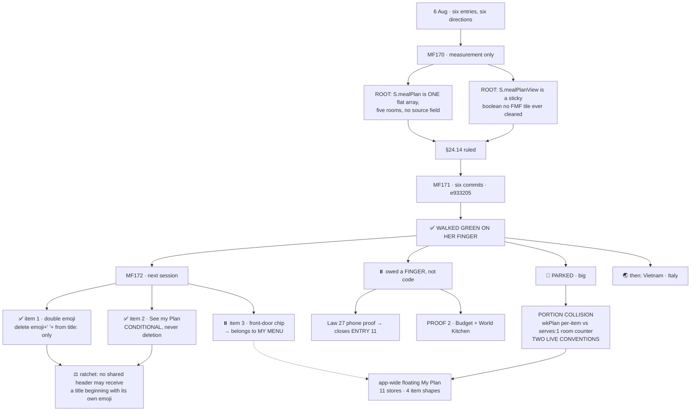

# FMF_SESSION_CLOSE_6AUG.md — open the next chat with this
**Written 6 Aug 2026, 10h20.** Open the next chat with this file, `reference/FMF_PLAN_SOURCE_RULING.md` and `CLAUDE.md`.
**HEAD at writing: `e933205`, pushed, published on Netlify 10:02, walked green by Tina.**

> ⚠️ **NO LINE NUMBERS.** Every anchor is a **SYMBOL**. ⚖️ RUNG 1f.

---

## 0 · WHAT SHIPPED AND WAS WALKED

# §24.14 IS DONE. SIX COMMITS. GREEN ON HER FINGER, ON THE DEPLOYED BUILD.

| sha | commit |
|---|---|
| `aa61265` | MF170 reference: FMF plan store ruling, corrections folded |
| `bf0f35e` | **MF171-1** §24.14: the five FMF room tiles clear `S.mealPlanView` |
| `474da32` | MF171-C doctor **rung 16**: the room door must clear the sticky view flag |
| `4875883` | **MF171-2** §24.14: generic `source` on the plan item, grouped in `core.js` |
| `ae173b4` | **MF171-3** §24.14: the plan heading stops naming a room |
| `e933205` | MF171-D doctor **rung 17**: the plan never claims a room it does not own |

**Gates:** Doctor RED 10 (identical baseline, same ten lines, same order) · lawcheck DRIFT SCORE 0 ·
rungs 16+17 green, born-RED proved · MF171-2 proof 15/15 · MF171-3 proof 18/18 ·
**not one `costPP` moved — proved byte-identical.**

**Tina's walk, deployed build, as Pro:** four dishes from four rooms · every tile tap landed on its
**dish list** · heading read **My Plan** · groups read SUPPER · BREAKFAST · LIGHT LUNCH · BAKES AND
CAKES, each with its own dish · top-back `← Family Meals` correct · plan survived the whole walk.
⚖️ **Law 2 satisfied.**

---

## 1 · ▶️ START HERE — MF172, RULED, NOT YET BUILT

**Two items go together in one commit. The third is parked.** Measurement is done (HEAD `e933205`,
nothing edited). Code has the full measurement in its own transcript; the rulings are below.

### ✅ ITEM 1 — the double emoji. GO.
`sectionPlanView` builds `header:{ title:emoji+' '+title, emoji:emoji, … }` and `sectionHeader`
renders `${emoji} ${title}`. **Delete `emoji+' '+` from the `title:` field. Nothing else.**

⛔ **`emoji:emoji` MUST STAY.** `sectionHeader` also uses it for the **no-photo fallback tile** (the
52px glyph when the header image is missing). Removing the parameter instead of the concatenation
strips that icon from every plan screen.

✅ `window._sectionPlanTitle` is set from the `title` **parameter**, not the header string — the
WhatsApp share text is untouched. **One deletion, three rooms, all three improve, no room made to lie.**

### ✅ ITEM 2 — `See my ${title} Plan`. GO, AS A CONDITIONAL.
`sectionPlanBtn` renders `See my ${title} Plan & Shopping List →`.

| caller | renders | honest? |
|---|---|---|
| FMF · any shelf | *See my **Breakfast** Plan…* | ⛔ no — one flat array serving five rooms |
| Budget | *See my **I've Got R100** Plan…* | ✅ yes — `budgetPlan` is that room's own |
| Just Feed Me | *See my **Just Feed Me** Plan…* | ✅ yes — `moodPlan` is that room's own |

⛔ **THE NAIVE FIX IS THE WRONG FIX.** Dropping `${title}` gives all three *See my Plan* — that does
not make Budget and Just Feed Me lie, but it **deletes true information from them.** A different
injury, still a loss.

✅ **Ship the conditional:** `See my ${title ? title+' ' : ''}Plan & Shopping List →`.
FMF passes `''`. Budget and Just Feed Me render **byte-identically to today.** Only the liar changes.

📌 **Measured aside worth keeping:** both **Free** branches already read *"My Plan — Tinza Pro"* —
room-free and honest. **The Free state has been right all along; only the Pro state lied.**

### ⚖️ THE RATCHET — SHIP IT WITH THE FIX
**Law 42, born-RED both ways:** *no shared header may receive a title that already begins with its
own emoji.* Re-add the concatenation → RED. Remove → GREEN.

⚠️ Rung 17 Half B reads the **caller's** title argument to `sectionPlanView`; item 1 changes that
function's body and item 2 changes `sectionPlanBtn`. **Neither trips rung 17.** Item 2 leaves FMF
passing `''` — no room name — and stays green.

### ⏸️ ITEM 3 — the FMF front-door chip. PARKED. DO NOT BUILD IT.
🩸 **It is NOT a missing render. It is a missing DESTINATION.** Measured:

- `sectionHeader` builds `myPlanBtn` from `o.myPlan`; `mealSectionHTML` passes
  `myPlan:{ count:(S.mealPlan||[]).length, onclick:"setQuiet({mealPlanView:true})" }`.
- `feedingFamilyHTML`'s `sectionHeader({…})` call has **no `myPlan` key at all.**
- ⛔ **Adding the key would not work.** With `mealPlanView = true` the front door renders **the five
  tiles, no plan** — the flag is **INERT on that screen**; only `mealSectionHTML` tests it.
- 🩸 **Worse than nothing:** `setQuiet` calls `draw()` like `set`, and `mealPlanView` is in
  `navSignature()`. So the tap would **push a history entry while changing nothing on screen** — a
  phantom level and a Back press that appears to do nothing. **§24.7's pill-tap disease, the thing
  five rooms have already bled by.**

Two routes were measured, **both bad**:
- **(a)** branch in `feedingFamilyHTML` mirroring `mealSectionHTML` — a **new nav level on a screen
  that has never had one**, owing a walked back-button proof under §24.6/§24.7
- **(b)** navigate to a room and open the plan there — ⛔ **reintroduces exactly the room claim
  §24.14 just removed**

### 🎯 ROUTE (c) — THE RULING: IT BELONGS TO **MY MENU**
The bottom-nav **My Menu** tab is a `comingSoonHTML` placeholder whose own body reads
*"One place for everything you've planned across all sections… For now, each section keeps its own plan."*

⚖️ **That is the front door for a plan that spans rooms — and FMF's plan already spans five.**
Building a chip on FMF's own door now means **building the wrong door twice.**
📌 **Item 3 is re-filed as: the FMF front door waits for My Menu. Not a bug. A dependency.**

---

## 2 · ⏸️ OWED A FINGER, NOT CODE

1. **LAW 27 PHONE PROOF.** Nothing persists any plan — Code proved it, `setPlan`/`getPlan` have zero
   app callers, `plans:{}` is built/versioned/migrated and **never written to by any room**. So the
   phone observation has **no code explanation.** The remaining candidate is a **service worker
   serving a cached page so `S` was never re-initialised.** ⚠️ **INFERENCE, not measurement.**
   **A five-minute walk on her phone closes ENTRY 11.**
2. **PROOF 2** — Budget and World Kitchen. The storage grep it was waiting on is done: **they persist
   nothing either.** It now needs only her finger. Assert **the dish is still in the plan**, not
   where Back landed.

---

## 3 · 🔴 PARKED, BIG, NOT FOR A MORNING

### PORTION COLLISION — one basket, many serves counters
⛔ **NOT hypothetical. World Kitchen already implements the other convention.**
`wkPlan` stores `servings` **per item** (`{id, servings}`). The shared-renderer family stores
`serves:1` and leans on **one room-level counter**. ⚖️ **Two live conventions to reconcile — not one
answer to invent.** Any single basket must reconcile them. Touches the gram tables and the taper.
**Blocks the app-wide floating My Plan. Its own session, clear head.**

### THE APP-WIDE FLOATING MY PLAN (parked 11 Jul)
**Eleven distinct plan stores, four item shapes.** `S.mealPlan` (FMF, five rooms) · `wkPlan` ·
`healthPlan` · `budgetPlan` · `moodPlan` · `babyPlan`/`dogPlan`/`catPlan` (bare ID strings) ·
`selectedMeats`+`selectedSides` (braai, two arrays one plan) · `spiceCart` (object map) ·
`fingerShopCart` · `eventSelectedFingers` · `checkedBuffetItems`.
⚖️ **World Kitchen is measured-proven separate** — different key, writer (`wkPlanToggle`), renderer
and item shape. **"My Plan (0)" while `S.mealPlan` held Cottage Pie is proof, not inference.**
📌 §24.14's generic `source` is the **first room to speak the format** — a rehearsal, not a detour.

⚠️ **Small flag, not touched:** `fingerShopCart` is declared `[]` in `data.js` but `fingerShopToggle`
writes `{}`. Harmless today — every read is `(S.fingerShopCart||{})[key]`.

---

## 4 · ⏸️ THE OLDER LIST — UNCHANGED TODAY

1. **ENTRY 6** — bottom Back from the plan → Tinza main, skipping FMF. **3× consistent.** May be
   partly resolved by MF171-1; **never re-walked since.** ⚖️ Re-walk before diagnosing.
2. **BUG 7** — mechanism not visible in `sections/`. Needs `_appNavDepth` in dev mode on her device.
   **Its own brief.**
3. **§24.13** — mood tile = LATERAL. **Ruled, not implemented.** BUG 4 unblocked, not closed.
4. **101 unclassified `NAV_DATA_KEYS`** — AMBER floor, not debt.
5. **Every ruling except §5** — unmeasured against the code. Rung 6. (Rungs 16+17 now measure §24.14.)
6. **The two buy ladders** — one behaviour, two implementations. De-dup when pack sizes land.
7. ⚡ **FREE, NO CODE:** tag `healthy` records one at a time. The shelf degrades, never blanks.

---

## 5 · 🌏 THE CONTENT LANE — WAITING, NOT BLOCKED

**Tina wants Vietnam and Italy next.** ⚖️ She chose to fix the roof first — MF172 is the last of it.
Standing lane state: Thailand open (`wk_thailand.js` empty but fully wired, banking sequence in
`reference/THAILAND_COLD_START.md`) · Japan closed 50/50 · Indonesia closed at 42 · China closed 50/50.

---

## 6 · ⚖️ THE RUNGS FROM TODAY

| rung | the thing that stood in for the truth |
|---|---|
| **9** | 🩸 **A HYPOTHESIS CAN BE RIGHT IN ITS PREDICTION AND WRONG IN ITS MECHANISM.** Claude ruled the slot branched on *plan contents*. It branches on `S.mealPlanView`. Every pass held. **Tina's test could not separate them — she added the dish and opened the plan one breath apart.** ⚖️ **When a test confirms, ask what else moved at the same instant.** |
| **10** | ⚖️ **THE NAIVE FIX DELETES TRUE INFORMATION.** Dropping `${title}` would stop FMF lying **and strip Budget and Just Feed Me of a true statement.** Not all fixes that remove a lie are improvements. |
| **11** | 🩸 **A MISSING RENDER AND A MISSING DESTINATION LOOK IDENTICAL FROM THE SCREEN.** The front-door chip looked like one absent key. It is a **new nav level** wearing that key's clothes. ⚖️ **Measure what the control would DO, not what it would SHOW.** |
| **12** | ⚖️ **CODE CORRECTED CLAUDE THREE TIMES AND WAS RIGHT EVERY TIME.** The `reset:` field was a home-tile field (five identical strings would be five places to drift) · the §3 hard-reload claim was mis-cited to the wrong file · the §0 item list omitted `cat`. **All three caught by reading before writing.** |

📌 **THE FAMILY, SIXTH SESSION:** *a thing that looks like a measurement but has quietly stopped
measuring what it names.* Today's specimens: `plans:{}` — **built, versioned, migrated,
census-tested, and no room has ever written to it. A door with no one walking through it.**

---

## 7 · 🗺️ THE FLOWCHART

⚖️ **Law 2 — done is when Tina's finger says so, on her own device.**
