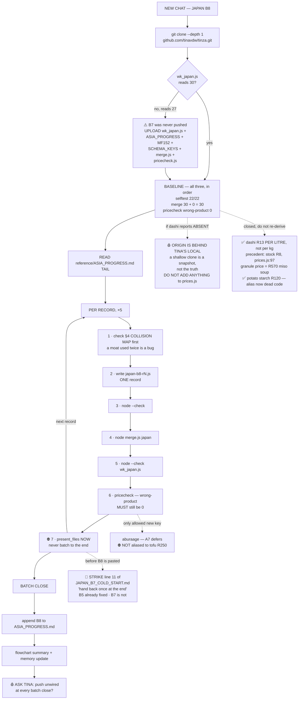

# 🇯🇵 JAPAN B8 — HANDOFF
**Written 29 Jul 2026 at the close of B7. Paste this whole file into the new chat as the first message.**

---

## 0. WHAT TO SAY IN THE NEW CHAT

> Japan B8. Author 5 records: Chikuzenni · Ebi Furai · Hiyayakko · Kake Udon · [5th, see §6].
> `git clone --depth 1 https://github.com/tinavdw/tinza.git`
> wk_japan.js is 30. Target 35. Read `reference/ASIA_PROGRESS.md` tail first.
> ⛔ HAND BACK A DOWNLOAD AFTER EVERY SINGLE RECORD. Never batch to the end.
> Setup: `TINZA_REPO=$PWD node sections/pricecheck.js --selftest` → 22/22
> `node merge.js japan /tmp/empty.js` → 30 + 0 = 30
> Then the warnings in §5 and §6 below.

⚠️ **If `wk_japan.js` at HEAD still reads 27, it was never pushed** — upload the B7 copy instead and
say so. See §7.

---

## 1. STARTUP — RUN THESE THREE, IN THIS ORDER, BEFORE AUTHORING A LINE

```bash
git clone --depth 1 https://github.com/tinavdw/tinza.git && cd tinza
echo "module.exports = [];" > /tmp/empty.js

TINZA_REPO=$PWD node sections/pricecheck.js --selftest   # expect: ✅ all 22 proofs pass
node merge.js japan /tmp/empty.js                        # expect: 30 + 0 = 30
TINZA_REPO=$PWD node sections/pricecheck.js japan        # expect: 🔴 WRONG PRODUCT — 0 · absent 38
```

If any of the three does not give the expected number, **stop and report it** — do not author
against a repo whose baseline you have not measured. That is the whole lesson of the MF152 audit.

---

## 2. THE PROCESS RULE THAT MATTERS MOST

**ONE RECORD = ONE HANDBACK.** For every single record, in this order, before the next one starts:

1. write the batch file (`japan-b8-rN.js`, one record, `module.exports = [ … ]`)
2. `node --check japan-b8-rN.js`
3. `node merge.js japan japan-b8-rN.js`
4. `node --check sections/wk_japan.js`
5. `TINZA_REPO=$PWD node sections/pricecheck.js japan` — check wrong-product is still **0**
6. `present_files` → `sections/wk_japan.js` + the batch file

⛔ **No "I'll collect the downloads at the end."** B7 was authored once and lost exactly that way.
A cut-off must cost one record, never a batch.

### ✅ THE COLD-START CHAIN IS FIXED — NOTHING TO DO BY HAND
The old cold starts carried *"hand back once at the end"* at line 11 — the instruction that lost B7.
It was a **copy-forward defect**: B7 inherited the line from `JAPAN_B5_COLD_START.md`, so every
future batch would inherit it too unless the chain was broken.

- ✅ `JAPAN_B5_COLD_START.md` — **fixed.**
- ✅ `JAPAN_B8_COLD_START.md` — **written correct from birth. Paste this one.**
- ⚪ `JAPAN_B7_COLD_START.md` — **spent.** B7 is closed and it will never be pasted again. It exists
  only in un-pushed local commits, so it was not touched: rebuilding it from HEAD would have deleted
  content (the §29 block-not-file rule). Delete it or leave it; it is dead either way.

⚖️ **NOT a new Law — decided 29 Jul.** The rule already exists (**SAVE AS YOU GO**, Tina, 22 Jul).
B7 exposed a **file contradicting an existing rule**, not a missing one. If this recurs a third time
it becomes a Law; until then it stays a note. **The standing habit: a cold start is written from the
previous one, so re-read it against the rules that already exist before shipping it.**

---

## 3. WHERE JAPAN STANDS — 30 / 50

| | count |
|---|---|
| main | 11 (37% — was 46% at B5) |
| side | 8 |
| starter | 6 |
| dessert | 4 |
| staple | **1 ← thinnest** |
| versions | 90 |
| crossLinks | 90, **0 dead** |
| vegan-capable | 22 / 30 |
| §26 union drift | **0 / 30** |
| `dashi` appears in | 13 records |

**The 30 banked, by id:**
`japan-staple-dashi` · `shoyu-ramen` · `tonkatsu` · `okonomiyaki` · `oyakodon` · `gyoza` ·
`chawanmushi` · `yakitori` · `tempura` · `dorayaki` · `onigiri` · `tamagoyaki` · `kare-raisu` ·
`agedashi-tofu` · `goma-ae` · `matcha-warabimochi` · `mitarashi-dango` · `takoyaki` · `zaru-soba` ·
`nikujaga` · `korokke` · `kinpira-gobo` · `buta-no-shogayaki` · `chirashizushi` · `nasu-dengaku` ·
`miso-soup` · `anmitsu` · **`karaage`** · **`ohitashi`** · **`inarizushi`**

---

## 4. THE COLLISION MAP — WHAT IS ALREADY OWNED, AND BY WHOM

This is the single most useful thing in this file. **Check a new record against it BEFORE authoring**,
not after. A moat or a law used twice is the sameness bug in content form.

| Owned by | Do not re-use |
|---|---|
| **Tonkatsu** | double-fry / two temperatures · panko |
| **Gu Lao Rou (China)** | double-fry, again — it is owned twice |
| **Karaage** | single fry · potato-starch chemistry (no protein / large granules / glassy shell) · the sound-change finish · 唐揚げ vs 空揚げ · Usa & Nakatsu |
| **Kare Raisu** | the ENTIRE naval moat — IJN, Takaki Kanehiro, beriberi, JMSDF Friday curry |
| **Nikujaga** | otoshibuta (the drop-lid) · sa-shi-su-se-so seasoning order · sugar before soy |
| **Buta no Shogayaki** | zingibain / the ginger protease · "younger than the ballpoint pen" |
| **Goma-ae** | the blanch argument (chlorophyll, magnesium ion, pheophytin) · squeeze TWICE · suribachi shear-not-impact · goma-suri the insult |
| **Ohitashi** | squeeze ONCE · hitashi-ji weak on purpose · the four verbs (aemono/ohitashi/sunomono/nimono) |
| **Onigiri** | salt on the HANDS · rice WARM never hot or cold · the 1978 packaging patent |
| **Tamagoyaki** | **THE ONE EGG RECORD — egg is CLOSED at 3** · strain the chalazae · roll while the top is wet |
| **Chirashizushi** | cut the vinegar in with a slicing motion in a WIDE FLAT dish · amylose/amylopectin · the sumptuary-law moat |
| **Inarizushi** | abura-nuki · cool-in-the-liquid · fill to two-thirds, seam down · Inari/fox/offering · Kanto tawara vs Kansai sankaku |
| **Okonomiyaki** | the flip · teppan-as-dining-table · **the breathing bonito flakes** |
| **Takoyaki** | the QUARTER-TURN (explicitly not a flip) · radio-yaki ancestry |
| **Korokke** | lift onto a RACK never paper · dry the mash in the hot empty pot |
| **Miso Soup** | never boil miso · ichiju-issai · miso as samurai stipend |
| **Anmitsu** | agar → petri dishes (Minoya Tarozaemon, Walther & Fanny Hesse, Koch) |
| **Zaru Soba** | toshikoshi soba · rub until they SQUEAK · keep the soba-yu |
| **Kinpira Gobo** | kinpira-is-a-technique · Sakata no Kinpira · burdock→Velcro |
| **Chawanmushi** | — (check the record before reusing anything from it) |

---

## 5. PRICE — READ THIS BEFORE TOUCHING A PRICE KEY

### ⚖️ THE STANDING LAW
> **An MF152 append is not written until it has been measured against `prices.js`, NEVER against
> MF152.** The real gate is `sections/prices.js` at HEAD **and both alias maps**
> (`core.js` ~1050/1138, `worldkitchen.js` ~461/497). A key wrongly parked as "already there" is
> worse than a duplicate AND worse than a missing one, because it announces itself never.

### ✅ DASHI AND POTATO STARCH ARE CLOSED — AND THE *REASONING* IS THE PART THAT TRAVELS
Both keys are live in Tina's `prices.js` (commit `japan` / `0ef4d75`). Full arithmetic in
`reference/MF152_ASIA_PRICE_KEYS.md`. **Do not re-derive either one, and above all do not re-derive
dashi as a granule price.**

⚖️ **`"dashi": 13` is PER LITRE OF MADE-UP DASHI, not per kg of granules.**
Every Japan record writes dashi in **ml**, and an ml line costs as `(qty / 1000) × price`. So the
unit the key is quoted in has to be the unit the ingredient line is written in. Priced per kg of
instant granules instead, a 300ml bowl of miso soup would have been charged **R570**.

📌 **This follows an exact existing precedent — `prices.js:97`:**
```js
"stock": 8,   // LIQUID stock (per L) — was 170 (powder price) which over-priced 68+ recipes using "<ml> stock"
```
Same bug, same fix, one dish earlier. **Any future concentrate, paste, granule or stock-like key must
be quoted in the unit the recipes actually write it in.** That is now a general rule, not a
dashi footnote — check it on kaeshi, mentsuyu, curry roux and anything else sold dry but used wet.

✅ **§29 is therefore fully closed:** route ruled *and* price sourced. The "hon dashi shelf price
still unsourced" item from earlier notes is **struck**.

✅ **`potato starch` R120 is live, and the alias is NOT a shadow bug — measured, not assumed.**
`wkPriceLookup` (worldkitchen.js:519) tries `PRICE_DB[n]` **directly on its third line**, and only
reaches `WK_ALIAS` four lines later. So the real key wins and the `core.js:1340 potato starch →
cornflour` alias is simply **dead code** now. No wrong price. ⚠️ Worth a tidy-up line eventually —
a dead alias is not dangerous, but it is a lie about what the app does.

⚠️ **A shallow clone is a snapshot, not the truth.** If a fresh clone reports `dashi` ABSENT across
13 records, **origin is behind Tina's local copy** — that is a false alarm about the repo, not a gap
in the data. **Confirm the push state before adding anything to `prices.js`.** This has now bitten
three times (TINZA_SPRINT_PLAN split-brain · the §29 handback · B7 close).

### 🔴 STILL GENUINELY OPEN
- **`aburaage`** — new at B7, ABSENT, **A7 defers it**. ⛔ **Do NOT alias it to `tofu` R250.**
  Aburaage is thin tofu sliced, dried and twice-fried — a different bought product. Aliasing makes a
  **wrong** number where there is currently an honest **missing** one, which is backwards on the
  MF137 ladder.
- ~~**Hon dashi granules** — SA shelf price unsourced.~~ **STRUCK — closed at R13/L. See above.**
- **`mushroom` R165 and `mushrooms` R90 are BOTH live keys at different prices.** Pre-existing.
  Use the plural in new records (longest-key match picks `mushrooms`).
- A7 has taken exactly **one** exception to date: `chilli oil` R490, because it was a WRONG price
  already shipping, not a missing one. Everything genuinely missing still waits for the batch.

### ⚠️ AUTHORING TRAPS pricecheck HAS ALREADY CAUGHT
- **note-tail bug** — `"coarse salt, for curing the salmon"` priced as salmon R680. Never let a price
  word sit in the prep/note tail. `"5g fine salt"` plain, not `"fine salt, for the blanching water"`.
- **parenthetical bug** — `"3 sheets aburaage (fried tofu pouches)"` would match `tofu` R250. Explain
  the ingredient in the METHOD, never in the ingredient name.
- **count-vs-weight** — `"cooked yakisoba or egg noodles"` read 150g as 150 **eggs**.
- **singular/plural** — Kare Raisu's `"30g apple"` vs the key `apples`.

---

## 6. ▶️ JAPAN B8 — THE SHORTLIST (30 → 35)

**Thinnest courses: staple 1, dessert 4.** Prefer at least one staple.

| Candidate | Course | Notes |
|---|---|---|
| **Chikuzenni** | side/main | Clean. Nimono, the New Year table. ⚠️ otoshibuta belongs to Nikujaga — one clause and a pointer only. |
| **Ebi Furai** | starter | Clean-ish. ⚠️ panko is Tonkatsu's — lead on the straightening cut (nicking the belly so the prawn cannot curl). |
| **Hiyayakko** | side/starter | Very clean, very cheap, vegan-capable. Cold tofu — the whole record is about the tofu itself and the toppings. Good balance filler. |
| **Kake Udon** | main/staple | Could take the **staple** slot as a kaeshi/broth record. ⚠️ do not re-teach dashi (staple record owns it) or the noodle rinse (Zaru Soba owns the squeak). |
| **Taiyaki** | dessert | ⚠️ **overlaps Dorayaki** — needs a lead that is neither the batter nor the red bean. |
| **Katsudon** | main | ⚠️ **overlaps Tonkatsu AND Oyakodon.** Plausible lead: the **half-set egg** as a doneness law. main is already 11, so low priority. |
| **Sukiyaki** | main | ⛔ **BLOCKED — needs a Tina ruling first.** The raw-egg dip against egg CLOSED at 3, plus the Chongqing Hotpot collision. |

**Suggested five:** Kake Udon (staple) · Hiyayakko (side) · Chikuzenni (side) · Ebi Furai (starter) ·
Taiyaki (dessert) — fills the two thin shelves and adds nothing to `main`.

---

## 7. ⛔ WIRING & PUSH — UNCHANGED, AND OVERDUE

`wk_japan.js` is **NOT WIRED and NOT PUSHED.** Wiring is two lines, at Japan close:
1. `index.html` → `<script src="sections/wk_japan.js"></script>`
2. `worldkitchen.js:58` → `window.WK_JAPAN || [],` in the `wkPool()` concat

`WK_COUNTRY_GEO` is already done for all five lane countries.

### 🩸 PROPOSED AMENDMENT — NEEDS TINA'S RULING, NOW WITH TWO ARGUMENTS BEHIND IT
> **Push `wk_japan.js` UNWIRED at every batch close.** One deploy credit, zero change to the live
> app, and 30 records stop being one dead container away from gone.

B7 was lost to a dead container. That is the second argument; the first was B3.

⚠️ **New-chat startup:** the container resets. If the file is not pushed, Tina must **UPLOAD**
`wk_japan.js` + `ASIA_PROGRESS.md` + `MF152_ASIA_PRICE_KEYS.md` + `ASIA_SCHEMA_KEYS.json` +
`merge.js` + `sections/pricecheck.js` at the start of the chat.

---

## 8. THE RULINGS THAT BIND THIS LANE

| | |
|---|---|
| **A1** | one file per country |
| **A2** | greenfield — `wk_world.js` is South Asia ONLY; `cuisine: 'east-asia'` for Japan |
| **A3** | schema control lives in `reference/ASIA_SCHEMA_KEYS.json`, **not** record 1. `costPP` on VERSIONS never the record. Budget fork **LEADS** and must be cheapest. Exactly one `default:true`. |
| **A4** | icons only |
| **A5** | staples are real cards |
| **A6** | exactly 3 crossLinks; a dead target fails merge |
| **A7** | prices deferred to one batch after all five countries — **but A7 defers MISSING prices, never WRONG ones** (§29.5) |
| **§26** | diet lives on the VERSION; record diet is the **derived union**. China's 50 convert at LANE CLOSE. |
| **§28** | `leftovers` is an ARRAY |
| **§29.1** | a staple gets a PRICE_DB key **iff** a real bought product fills the slot |
| **§29.2** | a staple inside another card's ingredient line is costed as the product a cook BUYS |
| **§29.3** | `dashi` is ANIMAL; `kombu and shiitake dashi` is not, and they must not substring-match |
| **servings** | always `1` — amounts are per-serving, the app scales them |
| **vocab** | diet = omnivore / vegetarian / vegan / unknown ONLY. Halaal + kosher are SEPARATE laws. |
| **wording** | ⚖️ no SA shop or place names in prose — "the stand-in", never "the SA stand-in" |
| **delta** | `addIng`/`removeIng` → `{item}` · `addStep` → `{text}` · `swapIng`/`swapStep` → `{from,to}`. No empty `to` (deletions use `removeIng`). The `from` must appear **verbatim** in the base. |
| **ruling** | ⚠️ Hand rulings back as a **BLOCK**, not the whole file, whenever HEAD may be behind Tina's local copy. `TINZA_RULINGS.md` at HEAD stops at §25 — §26/27/28/29 exist only locally. |

### PRECEDENTS FOR "NOT AVAILABLE IN SA"
Three now, all the same shape — **lead on the accessible route, name the real thing honestly
in-method, create no price key**: warabi starch → cornflour · burdock (gobo) → carrot + parsnip ·
"leftover Japanese curry" → the from-scratch route (rejected outright under §29.1).

---

## 9. VALIDATOR GAPS STILL OPEN — RUNGS TO WRITE, NOT PATCHES

1. **`merge.js` FLESH list is missing `octopus` and `dashi`.** `japan-takoyaki` sailed past the
   mis-tag check with 60g octopus. Two words closes it. ⚠️ Do not add `kombu and shiitake dashi` as a
   false friend by substring.
2. **The vegan-mistag warn cannot see version deltas** and says so in its own comment. Since §26 it
   fires on nearly every correctly-authored record. Either it becomes noise, or the rung learns to
   apply the delta first.
3. **`crossLinks` cannot cross countries** — `merge.js` resolves against the country file only, but
   `wkPool()` is global. **Needs a ruling, not a patch.** Do not loosen the assertion to fit.
4. **`leftovers` has no renderer** — nothing reads `r.leftovers`; WK renders `wkLeftoverKeys()`
   (core.js:4765), a keyword guess. Code brief unwritten: authored leftovers WINS, guesser is
   fallback. ⚠️ **Do NOT delete the guesser** — it feeds LEFTOVER_CLASS→SAFETY_CLASS, a food-safety
   engine.

✅ **CLOSED at B7:** the §26 union assertion. B6 recorded that `merge.js` had none; it is there now
(~line 168), derives the union from `versions[].diet`, compares as a sorted set, fails either way.
All 30 records pass with drift 0. **That B6 open item is struck.**

⚠️ **STRUCK and must stay struck:** "regenerate `ASIA_SCHEMA_KEYS.json` from record 1 at the start of
every batch." Doing it breaks `merge.js` and is the exact drift the file exists to prevent. The list
is frozen from `wk_china.js` @ 43 records. **Do not regenerate it.**

---

## 10. 🩸 OPEN OUTSIDE THE ASIA LANE — NOT THIS SESSION, BUT NOT FORGOTTEN

Just Feed Me 3-recipes fix (`getMoreMoodRecipes` LIBRARY pages, W1 S4, §21.1 gate) · MF132 §2.E/F
money close (W1 S2) · MF148 Playwright (Code builds; unblocked since MF151) · §21.2 MF123
healthy-is-not-a-diet · MF147 behaviour rungs (W1 S5) · R50→R90 sweep · mojibake ~231 World Kitchen
names · biscuits search → dog food · Chef pitch hide (W1 S3) · fix-queue ⑤ version-label +
chip-preselect (own session) · `sharedWith` string→list (1021 records) · Events ③ buffet 7 headers ·
diet filter RED (118 vegan invisible) · 4 rooms no cost · `shareList()` ×21 · TINZA_PRICE MF91 ×21 ·
`openSectionSearch` MF95 · `budget.js` + `tinyTummies.js` have no `sectionHeader()` · Toum straggler
`wk_africa.js` ~:132 · bar planner rework · Tiny Tummies + Furry redesign (W3) · **Fable S3 POST-RESET
ONLY.**

**Open questions:** `core.js:656` `_warm` allow-list is missing HOME · "§11" names three different
things in the rulings file.

**Marketing** starts once the app is streamlined: strategy 1-pager → content calendar
(IG / TikTok / Pinterest, EN + AF, son's AI photos) → launch assets. Fermentastic list = day-one
audience.

---

## 11. THE MAP


