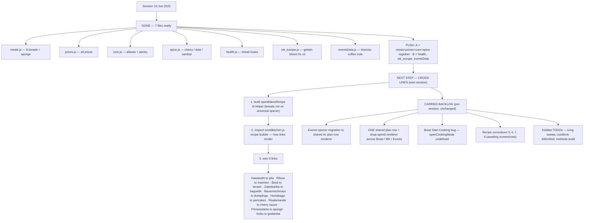

# TINZA — Session Handoff · 16 Jun 2026

**Session theme:** finished the price/alias gap-fill, built the bread set + sponge into the files, added Cherry Sauce / Date Paste / Sambar to Spice, fixed gelatin + coffee recipe wording. Everything below is **node --check clean** and was assembled by editing the *live* files (fetched from the repo), so they are drop-in replacements.

---

## ✅ PUSH CHECKLIST — 7 files ready for `sections/`

| # | File | What changed | Push group |
|---|------|--------------|-----------|
| 1 | `meals.js` | 8 breads + sponge cake → `BAKES_RECIPES`, pills `breads`/`flatbreads`/`quickbreads`/`cakes`, `bk-` ids, banana keyed for cost | **A (together)** |
| 2 | `prices.js` | all session prices: veal 375, saucisson 650, fine semolina 43, yam 227, gelatin 350, tea 300, coffee 1050, fennel seed 590, `_each` count keys, halloumi/mozzarella dearer-update | **A (together)** |
| 3 | `core.js` | ~97 aliases incl. Bucket A, veal-cuts→veal, cornstarch/maizena/starch→cornflour; Bucket B pantry sweep; gelatin pulled OUT of pantry | **A (together)** |
| 4 | `spice.js` | Cherry Sauce + Date Paste (sauces shelf), Sambar Masala (blends shelf) | **A (together)** |
| 5 | `health.js` | Bread Kvass (Beet Kvass left alone) | B (independent) |
| 6 | `wk_europe.js` | Citronfromage + Ptichye Moloko gelatin methods fixed (bloom step) | B (independent) |
| 7 | `eventsData.js` | Tiramisu instant-coffee conversion added to tip | B (independent) |

> Group A lean on each other for costing — push them in one go. Group B are standalone.
> Rule 5 each: Show in Explorer → drag into `sections/` → replace → commit → push. LF↔CRLF warning harmless.

---

## 🔁 FLOWCHART

---

## 📋 TO-DO TRACKER

### Closed this session
- [x] Price the full exotic tail (yam, papaya, jackfruit, saucisson, semolina, malt, black-eyed-pea flour, marmalade, wafer, candied fruit, palm nut extract, berry sauce, veal, gelatin, tea, coffee, fennel seed)
- [x] Bucket A aliases + Bucket B pantry sweep applied
- [x] cornstarch / maizena / starch → cornflour (corrected from the wrong maize-meal mapping)
- [x] gelatin re-classed as a real costed ingredient (out of pantry)
- [x] 8 breads placed in Bakes (correct pills, `bk-` ids, no pancake dup)
- [x] Sponge cake placed in Bakes → Cakes
- [x] Cherry Sauce + Date Paste → Spice sauces; Sambar Masala → Spice blends
- [x] Bread Kvass → Health
- [x] Gelatin standard applied to the 2 real gelatin recipes (Citronfromage, Ptichye Moloko)
- [x] Tiramisu coffee amount clarified

### Open — next session
- [ ] **CROSS-LINKS** — build `openBakesRecipe(id)` helper, inspect `worldkitchen.js` builder, wire the 9 links
- [ ] (optional) price the last pantry odds: `sambar`, `khmeli suneli`, `tarhana` — fine unpriced as pinch pantry
- [ ] (optional) move `bf-pancakes` from Breakfast into Bakes if you'd rather it live there

### Standards locked this session
- **Gelatin:** bloom in cold water (~5× its weight) → dissolve gently, never boil. 10g/500ml soft set; 15–20g/500ml firm. Leaf 1≈2g.
- **Coffee:** ~1 tsp (5ml) instant per 250ml water; stronger for a tiramisu dip (~2 tsp/250ml). Never a vague "add coffee".
- **Pricing:** duplicate → dearer; single range → middle.

### Carried backlog (untouched, from before)
- [ ] Events opener migration → shared §4c plan-row renderer → Events My Plan overlay → cull dead Events code
- [ ] ONE shared plan-row + shop-spend total renderer across Braai / World Kitchen / Events
- [ ] Braai "Start Cooking" bug — `openCookingMode()` undefined repo-wide
- [ ] Recipe corrections #3, #4, #7, #8 (awaiting screenshots/text)
- [ ] Kiddies: icing_butter/icing_milk sweep, cooldrink 400ml/kid + ±, methods/ingredients audit
- [ ] Spice cross-links, cosmetic sameness sweep (LAST), then fill recipes
