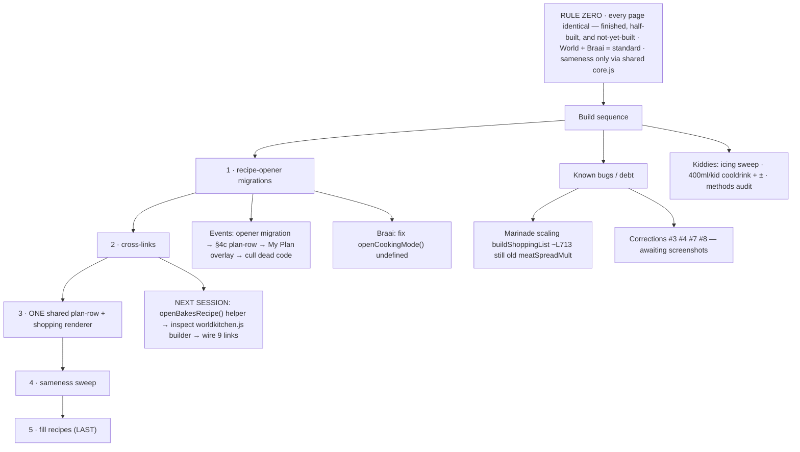

# CLAUDE.md — Tinza working agreement (read this first, every session)

> Auto-loaded by Claude Code at the start of every session. This is the operational spine.
> The **deep** standard lives in `TINZA_STANDARD.md`. **If this file and chat ever disagree, the Standard wins.**

---

## ⚠️ RULE ZERO — SAMENESS IS LAW (top priority, no exceptions)

**Every single page must LOOK and FUNCTION identically.** This applies to:
- finished pages,
- half-built pages,
- **and pages that don't exist yet.**

A new section is **born matching the standard** — it is never built loose and "made to match later." If you scaffold a page, you scaffold it from the standard on line one.

**The reference implementations are World Kitchen and Braai.** They ARE the standard — we're close to locking them as the gold pair, and everything else follows from them. When anything is ambiguous, open World Kitchen and Braai, and copy them **exactly**.

Sameness is required **down to the smallest detail**: header photo treatment + height, the My Plan white overlay pill, collapsible behaviour, box styling, pill rows, nav, spacing, colours, and font sizes (title 22 / name 16 / line 14 / labels 13 / body 16). **Rooms differ ONLY by photo + emoji — nothing else.**

**Mechanism (this is the whole game):** sameness comes ONLY from shared `core.js` functions — *build once, call everywhere.* If two pages differ, the fix is to route BOTH through the same shared function. **Never** hand-patch one page to imitate another — that creates drift, and drift is the enemy.

> Before declaring any page "done," open it beside World Kitchen and Braai and confirm pixel-for-pixel, behaviour-for-behaviour parity.

---

## 0. Session protocol (do this before touching any code)

1. Open **https://tinza.netlify.app** and confirm what currently works. Don't trust memory — confirm.
2. Read the two governing docs fresh (they may have changed since this file):
   - `TINZA_STANDARD.md` (v1.8 — design + portion + costing law)
   - `TINZA_HANDOFF.md` (running backlog + last session's to-do)
   - Fetch via `curl -sL raw.githubusercontent.com/tinavdw/tinza/main/<path>` — **never** the GitHub API.
3. **`TINZA_STANDARD.md` wins over anything said in chat.**
4. `node --check sections/<file>.js` must pass before any file is committed. No exceptions.
5. Close every session by updating `TINZA_HANDOFF.md`: summary + Mermaid flowchart + full to-do + carried backlog.

---

## 1. What Tinza is

SA recipe & catering PWA. **Vanilla JS, no framework, no build step.**
- Repo: `tinavdw/tinza`, branch `main`. Live: `tinza.netlify.app`. Local clone: `…\Documents\GitHub\tinza`.
- Deploy: push to `main` → Netlify auto-builds.
- Shape: a 98-line `index.html` shell loads `core.js` + the section files in `sections/`.
- No test suite, no bundler. "Build" = `node --check`. "Test" = load the live site and click through against World/Braai.

---

## 2. Architecture — the rules that keep it sane

**`core.js` is sacred.** Before editing it: back it up and note `wc -l` before/after. It holds everything shared:
- Universal recipe opener: `openRecipe(section,id)`, `closeRecipe()`, `RECIPE_SOURCES`, `RECIPE_BUILDERS`
- Shared UI builders: `sectionHeader()`, `qtyBox()`, `recipePhoto()`
- Pricing engine: `lookupPrice()`, `ingredientCost()`, `calcRecipeCost()`, plus `PRICE_DB` + ingredient aliases
- The portion brain (`calcMeat`, portion tables)

**Section files** (each must match Braai **v33** exactly — see Rule Zero):
`data.js` (Braai) · `worldkitchen.js` + `wk_southafrica.js` / `wk_europe.js` / others · `health.js` · `kiddies.js` · `buffet.js` · `eventsData.js` · `spice.js` · `meals.js` · `prices.js`.

**Rendering:** state-driven, set/draw pattern (set state → redraw).

---

## 3. Locked standards (the non-negotiables)

**Portion brain (Standard §6.1).** Everyday g: boneless 180 / bone-in 250 / fish 160 / veg 200 / side 150. BRAAI tier: boneless 300 / bone-in 400 / fish 280 / shellfish 320. Taper per extra guest: 1=100% · 2=70% · 3=58% · 4+=50% each, then +10% buffer + appetite. **Braai `calcMeat` uses per-meat `soloG`/`sharedG` in `data.js` as the single source of truth** — the flat `PORTION_BRAAI` cut-class override must **not** be reintroduced. Kebabs counted RAW, not by skewer.

**Free / Pro (R99/mo, no third-party ads ever).**
- FREE: browse + cook/view full recipes + scale with ± + 1 dietary restriction + calories shown + Anchor Ingredient. **No cost figures, no My Plan, no shopping, no nutrition breakdown.**
- PRO: everything else — cost (food cost pp + total, green `qtyBox` cost line, gold shop-spend total) + My Plan + shopping + downloads + full nutrition + all dietary restrictions + AI Chef + pantry + leftovers + monthly letter + community + magazine.
- Calories always free; nutrition breakdown is a Pro toggle. `planView` + `shoppingView` are Pro (peekable lock for free).

**Two-cost model (app-wide).** "What the food costs" (exact grams) vs "What you'll spend at the shops" (pack-rounded). **One** shared Braai+WK+Events plan/shopping renderer. Pantry items grouped as "you may already have."

**Plan dish-row (Standard §4c).** name + grams TOTAL under name ("480g total") + GREEN per-dish food-cost TOTAL on the right (`#c8e840`, label "Food cost", total for all guests not per person, hidden if unpriced). Gold `#f5c842` = shopping list only.

**Ingredient standard.** Name = what you BUY, matching `PRICE_DB`. Amount = weight (g/kg) + pack hint; count for unit-sold items. One ingredient per line, no "+" lines. Prep goes in the METHOD, not the name.

**Gelatin / coffee (locked 16 Jun).** Gelatin: bloom in cold water (~5× its weight) → dissolve gently, never boil; 10g/500ml soft, 15–20g/500ml firm, leaf 1≈2g. Gelatin is a **costed ingredient, not pantry.** Coffee: ~1 tsp (5ml) instant / 250ml water; ~2 tsp/250ml for a tiramisu dip. Never "add coffee".

**Pricing convention.** Duplicate entry → take the dearer. Single range → take the middle. Walnuts R37/100g · Kudu R195/kg · Parmesan block R500/kg (ingredient) / grated R100/150g (topping) · fresh herbs R13/20g.

**Voice & design — "quiet kitchen energy."** Terse, knowing, slightly wry; plain words with adult thoughts; warmth earned through specific sensory detail; never explain down to the reader. A "How This Feels" one-liner on every recipe.

---

## 4. Build sequence (don't skip ahead)

`recipe-opener migrations` → `cross-links` → `ONE shared plan-row + shopping renderer` → `cosmetic sameness sweep` → `then fill recipes`.

Note: per Rule Zero, sameness is not only the late "cosmetic sweep" — it is enforced **as you build**, on every page, the moment it's touched or created.

Tactical order in flight: **finish Events → Spice → compare all ready pages.**

---

## 5. Current backlog (snapshot — keep in sync with TINZA_HANDOFF.md)

**Baseline is current:** the 7 files from 16 Jun (`meals.js`, `prices.js`, `core.js`, `spice.js`, `health.js`, `wk_europe.js`, `eventsData.js`) **plus the latest meals work are pushed to `main`.**

### Immediately next: CROSS-LINKS (its own session)
- Build `openBakesRecipe(id)` helper — breads are **not** on the universal opener yet.
- Inspect `worldkitchen.js` recipe builder to see how links render.
- Wire the 9 links: Hawawshi→pita · Rfissa→msemen · Beyti→lavash · Zapiekanka→baguette · Bauernschmaus→dumplings · Hortobágyi→pancakes · Risalamande→cherry sauce · Prinsesstårta→sponge · Kottu→godamba.

### Carried backlog
- Events opener migration → shared §4c plan-row renderer → Events My Plan white overlay → cull dead Events code.
- ONE shared plan-row + shop-spend total renderer across Braai / World Kitchen / Events.
- Braai "Start Cooking" bug: `openCookingMode()` is undefined repo-wide — give Braai the migrated cook-mode pattern, or remove the button as interim.
- Marinade scaling in `buildShoppingList()` (~line 713) still uses the old `meatSpreadMult` model — only main-protein portion was corrected.
- Recipe corrections #3, #4, #7, #8 (awaiting screenshots/text).
- Kiddies: `icing_butter`/`icing_milk` → plain butter/milk sweep across all 12 themes; cooldrink unify to 400ml/kid + ± adjuster; full methods/ingredients audit.
- Spice cross-links; then fill recipes (recipes filled LAST, after the spine is uniform).

### Optional / parked
- Price last pantry odds: `sambar`, `khmeli suneli`, `tarhana` (fine unpriced as pinch pantry).
- Decide whether `bf-pancakes` moves from Breakfast into Bakes.

---

## 6. Flowchart



---

## 7. Commands cheat-sheet

```bash
# verify a file parses (before every commit)
node --check sections/core.js

# pull a governing doc fresh
curl -sL raw.githubusercontent.com/tinavdw/tinza/main/TINZA_STANDARD.md
curl -sL raw.githubusercontent.com/tinavdw/tinza/main/TINZA_HANDOFF.md

# line-count guard before/after editing core.js
wc -l sections/core.js
```
