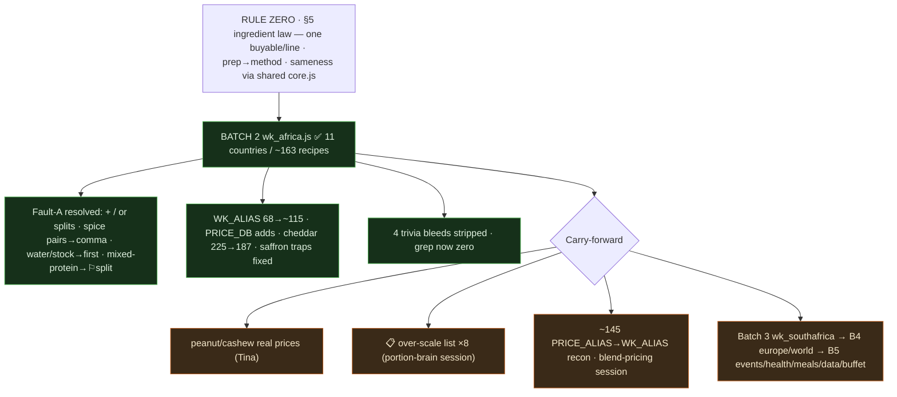
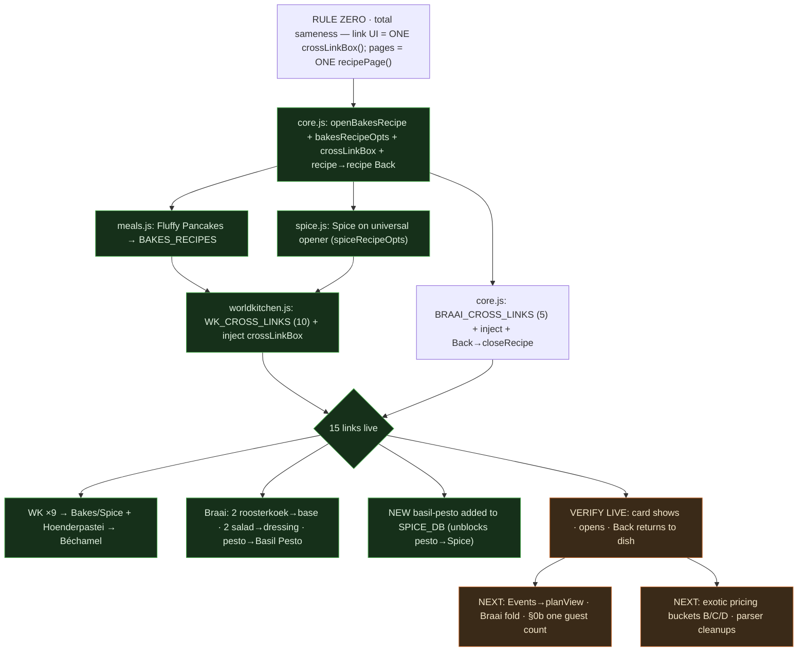

# TINZA — Session Handoff & Sameness Tracker
*Updated 16 Jun 2026 · read TINZA_STANDARD.md (now incl. §4g One Template) first every session*

## >> RIGHT NOW (pick up here)

### ✅ BATCH 3 (`wk_southafrica.js`) — INGREDIENT INTEGRITY SWEEP — COMPLETE (Southern Africa)
All **6 cuisine blocks** swept (**136 recipes**): Cape Malay (21) · Indian (21) · Zulu (14) ·
Sotho (14) · Xhosa (14) · **Boerekos (52** — header's "21 unique" was stale). Every Fault-A combo
resolved per §5; `ginger-garlic paste` kept as ONE line (own PRICE_DB key **R140**, overrides garlic);
the 7 Cape Malay `sharedWith:"Boerekos"` dishes are references (swept once in Cape Malay). Trivia-bleed
grep on wk_southafrica = **zero**. Touched: `wk_southafrica.js` · `core.js` · `worldkitchen.js`
(**WK_ALIAS ~115→~150**) · `prices.js` (adds: cashew nuts 430, peanuts 128, dried apricots 400,
ginger-garlic paste 140, grape juice 30, guinea fowl 180; cheddar 225→**187**). Every recipe prices
**except** the engine/parser bugs below. `node --check`-clean on all 4. **NOT yet pushed.**

### ✅ BATCH 2 (`wk_africa.js`) — INGREDIENT & RECIPE INTEGRITY SWEEP — COMPLETE
All **11 country-blocks** swept (~**163 recipes**): Egypt · Ethiopia (+straggler sweep) · Kenya ·
Morocco · Senegal · Tanzania · Tunisia · Zimbabwe · Mozambique · Nigeria · Ghana.
Every Fault-A combined ingredient (`+` / `/` / `or` joining two buyables) resolved per **§5**:
one buyable per line matching PRICE_DB, prep → method, real ORs → primary kept + alt → chefNotes,
spice/herb pairs → comma, `water/stock` → first-listed, mixed-proteins split with ⚐ amounts.
**4 trivia bleeds fixed** (Mapopo/MOZAMBIQUE, Ananás/WEST AFRICA, Chin Chin/GHANA, Shito/SENEGAL) —
trivia-bleed grep across wk_africa now returns **zero**.
Touched: `wk_africa.js` · `core.js` (PRICE_ALIAS) · `worldkitchen.js` (**WK_ALIAS 68→~115**) ·
`prices.js` (PRICE_DB adds: fresh sardines 115, dried fava beans 35, mixed nuts 30, orange blossom
water 360, samoosa pur 110; cheddar 225→**187**). Saffron amount traps fixed (Mrouzia, kept turmeric
in Biryani/Badjia). Every change `node --check`-clean. **NOT yet pushed.**

### Carry-forward (open items)
1. ~~Pending real prices: peanuts/cashews~~ ✅ **DONE** — PRICE_DB `peanuts` 128 (R32/250g) +
   `cashew nuts` 430 (R43/100g) added; aliases (ground peanuts/peanut/groundnut→peanuts,
   ground cashews/cashew→cashew nuts). **Batch 2 is now 100% priced** (only intended-FREE
   seasonings remain uncosted — harissa/berbere/piri-piri/cayenne/yaji/tabil/ras-el-hanout/mitmita).
2. **📋 wkEffectiveMult OVER-SCALE LIST (12)** — small-portion/condiment/split-protein/game-meat "mains"
   the portion brain scales to a full plate, inflating cost (engine NOT to be touched ad-hoc — dedicated session):
   Soupou Kanja ×3.0 · Fricassée ×3.2 · Mopane Worms ×3.75 · Matemba ×3.75 · Gango ×2.25 ·
   Matata ×2.67 · Shito ×5.0 · Kontomire ×4.0 · **Springbok ×9 · Warthog ×8 · Guinea Fowl ×9 · Braaivleis**
   (the game-meat ones: leg/fillet not in the main-protein regex → baseMult blow-up).
3. **📋 PARSER-CLEANUP session (NEW):** (a) `N garlic clove(s)` → parser eats the `g` → `arlic clove`,
   then matches the *cloves spice* R1022 (fixed the 2 named Boerekos recipes to gram-form; global fix pending);
   (b) `avocado` priced per-count R13 → a gram amount reads as N avocados (Gemsbok R416).
4. **3 parked sessions:** (a) **blend-pricing** all-or-nothing — harissa/berbere/piri-piri/tabil/ras-el-hanout/
   yaji/pepper-soup-spice/mitmita/cayenne/aniseed/allspice/white-pepper kept **FREE** (whitelist) for now;
   (b) **portion-brain over-scale** fix (the 12 above); (c) remaining **PRICE_ALIAS→WK_ALIAS** reconciliation
   (recipe-relevant ones synced as hit through Batches 2–3).
5. **NEXT — Batch 4** `wk_europe.js` + `wk_world.js` → Batch 5 `eventsData.js` / `health.js` /
   `meals.js` / `data.js` / `buffet.js`.

### Still pending from the cross-links session (verify/push if not already done — details below)
- PUSH cross-links batch (`core/meals/spice/worldkitchen`) + verify the 15 links live.



---

## EARLIER — CROSS-LINKS (banked, node-checked)

```
core.js
  - openRecipe/closeRecipe snapshot+restore _viewingRecipe
      => a recipe→recipe cross-link's Back returns to the ORIGIN recipe
  - NEW bakesRecipeOpts() + RECIPE_SOURCES.bakes/RECIPE_BUILDERS.bakes + openBakesRecipe(id)
      => Bakes (breads/flatbreads/cakes) render through the shared recipePage
  - NEW crossLinkBox() shared component (the one "Make your own →" card)
  - BRAAI_CROSS_LINKS map + crossLinkBox injected into the Braai recipe view;
    Braai recipe Back switched to closeRecipe() so the cross-link return works
      => roosterkoek-garlic-cheese/-boerewors→roosterkoek (base),
         biltongsalad→roquefortbraai, greekbraai→greekdressingbraai,
         pestopastasalad→basil-pesto
  - 2651 -> 2743 lines (backed up, no truncation), node --check OK

meals.js
  - Fluffy Pancakes MOVED Breakfast -> BAKES_RECIPES (id 'bf-pancakes' kept,
    cat 'quickbreads') so openBakesRecipe('bf-pancakes') resolves. node --check OK

spice.js
  - SPICE on the universal opener: spiceRecipeOpts() (reuses spiceCurScale+spiceFmt)
    + RECIPE_SOURCES.spice/RECIPE_BUILDERS.spice + openSpiceRecipe(id). Internal browse untouched.
  - NEW "basil-pesto" make-your-own added to SPICE_DB (amounts taken from the salad's
    own method) => unblocks pesto→Spice
  - FIX: spiceRecipeOpts yield label — "6 servings" no longer renders "6 6 servings"
  - node --check OK

worldkitchen.js
  - WK_CROSS_LINKS map (now 10): the 9 dish→Bakes/Spice + Hoenderpastei→bechamel-sauce;
    crossLinkBox injected into wkRecipeOpts notes slot. node --check OK

ALL 15 cross-links wired; every source + target id verified present (no dead links).
```

Rule Zero honoured: the link UI is ONE shared `crossLinkBox()`; the component pages
render through the SAME `recipePage()` as every other recipe. No page hand-patched.

---

## EARLIER (already pushed, for context)
- §4g **ONE TEMPLATE** folded into the Standard; **cost = Pro** re-lock (§7).
- Shared `buildPlanData` / `guestStepperCard` / `shoppingView` / `planView` built.
- **World Kitchen My Plan routed through `planView`** (two-cost block, pantry group,
  matching totals, dedup-by-priceName). prices.js + packs.js LIVE.
- WK pricing pass: +15 PRICE_DB entries, +34 PRICE_ALIAS, pantry routing, `mitmita`→pantry.
  Remaining exotic prices tracked in `TINZA_EXOTIC_TO_PRICE.md`.

---

## ROADMAP / TO-DO (next sessions)
```
 [DONE] Cross-links (this session)
   |
 1. SHOPPING/PLAN rollout: route EVENTS through planView/shoppingView
 2. Fold BRAAI onto buildPlanData (delete the duplicate cook/buy logic)
 3. ONE SHARED GUEST COUNT (Standard §0b): single session count used by
    landing/cuisine/recipe/plan; recipe green box opens at it (never 1)
 4. EXOTIC PRICING: apply Bucket B (pantry) / Bucket C (10 family prices) /
    Bucket D tail as Tina returns them — NEVER guess a rand
 5. PARSER CLEANUPS: vegetable/veg/palm ('/'-split artifacts), chouri o,
    fresh calf s liver; the "1 garlic clove" -> 'g'+'arlic clove' unit bug
 6. COSMETIC SWEEP (LAST): sectionHeader on health/meals/kiddies/tiny/furry/
    budget; kill gliding scales; remove meals search box
 7. THEN fill recipes
```

## CROSS-LINKS — all backlog items DONE (16 Jun)
- ✅ salad → dressing · ✅ pie → Béchamel · ✅ pesto → Spice · ✅ filled roosterkoek → base
  (plus the 9 World Kitchen dish→component). **15 total.**
- Future links reuse the pattern: a `*_CROSS_LINKS` map keyed by recipe id +
  `crossLinkBox()` in the section's builder; the target must be on the universal opener.

## WORKFLOW
- Push via GitHub Desktop only · `node --check` before every push · core.js sacred (back up first).
- Cross-link files are interdependent — push the 4 together.
- Fetch docs with `curl -sL` from raw.githubusercontent.com (never the API).


