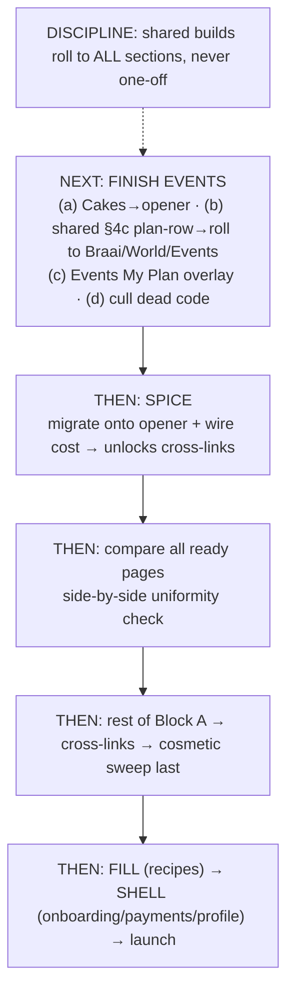

# TINZA — Session Handoff
_14 Jun 2026 · **NEXT JOB: finish Events completely → then Spice → then compare all ready pages.** Standard v1.9. Full tracker = TINZA_LAUNCH_CHECKLIST.md (44 items)._

> **New chat, open with:** curl `TINZA_STANDARD.md` + `TINZA_HANDOFF.md`, drop in `TINZA_LAUNCH_CHECKLIST.md`, then: _"Let's finish Events."_

---

## ▶️ THIS SESSION: Finish Events completely
Do these as one focused pass. **Discipline:** (b) and (c) are SHARED builds — build once and **roll to Braai + World + Events together**, never Events-only (that's what stops drift).

- **(a) Celebration Cakes → universal opener** (checklist #3). Move off `openCakeRecipe`/`activeCake` onto `RECIPE_SOURCES.cakes`/`RECIPE_BUILDERS.cakes` so cake recipe pages render through `recipePage()` like every other section.
- **(b) Build the shared §4c plan-row renderer** (checklist #5) → roll to Braai, World **and** Events. Fixes the Events inline-row drift (→ name · grams total under · green Food cost total on the right) and locks the other two at the same time.
- **(c) Events My Plan → white overlay pill, §4.1** (slice of #8/#9). Put the buffet header on the shared `sectionHeader()` (or at least the white overlay pill), replacing the grid tile.
- **(d) Cull dead Events code** (checklist #35): the parked `${et==='bigcooking'?…}` wrapper block + the orange `if(aer)` / `eventsRecipeView` / `eventActiveRecipe` plumbing.
- _(Beverages calculator = content build, Events tab still "coming soon" — deferrable to Phase FILL, not required to call Events "done" structurally.)_

**Then → Spice** (#1: migrate onto opener + wire cost; unlocks cross-links #2).
**Then → compare all ready pages** against each other for true uniformity.

---

## ✅ Live / pushed
- Events recipe pages on the universal opener (gold cost box + timers).
- This session's 3 fixes — **confirm pushed**: `events.js` (buffet standalone), `buffet.js` (slider labels), `eventsData.js` (hotel-pan rename).
- Push to repo ROOT: `TINZA_STANDARD.md` v1.9 · `TINZA_HANDOFF.md` · `TINZA_LAUNCH_CHECKLIST.md` · `TINZA_AUDIT.md`.

## 📌 Settled (don't re-decide)
- Plan-row layout = §4c (name · grams total under · green Food cost total right). Events inline = the drift, fixed by (b).
- My Plan = white overlay pill in the photo header, every section (§4.1). Not a grid tile.
- Recipe-page green box = under the recipe name, carries quantity + food cost (§4b).
- **On the opener already:** Braai · World · Health · Events · **Kiddies** (Kiddies is done — not pending).

## 🗂️ Everything else
Lives in **TINZA_LAUNCH_CHECKLIST.md** — 44 numbered items in 5 blocks (A Sameness · B Costing/data · C Fill · D Quality · E Shell). Tick as you go; that's the live tracker now.

---

## 🧭 Order flowchart

