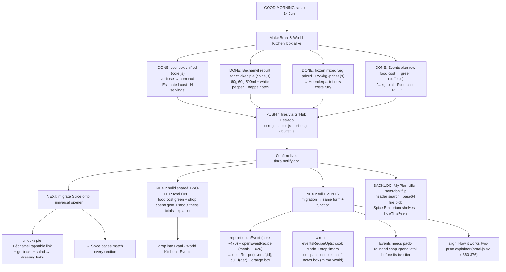

# TINZA — Session Handoff
_Last regenerated: 14 Jun 2026 — recipe-page cost box unified (Braai↔World), Béchamel rebuilt for the chicken pie, frozen mixed-veg priced. **PUSH core.js · spice.js · prices.js**_

---

## ✅ Done this session

### 1. Cost box made UNIFORM — Braai now matches World Kitchen (`core.js`, PUSH)
- The Braai recipe-page cost box was the **verbose** one ("💰 Cost Estimate · Total for N people · Based on X/Y · Checkers/retail prices · May 2026 · Always buy 10% extra"). You preferred the **compact** look.
- Rewrote that box (the Braai `costBlock` in `core.js`) to the compact design that World Kitchen already uses:
  - `💰 Estimated cost · N servings` on the left, big `~R___` (gold `#f5c842`) on the right
  - `Per person · ~R___`
  - one short line: `all ingredients priced` (or `Based on X/Y ingredients priced` when partial)
  - tilde `~` on amounts = estimate; **no** Checkers/May-2026/Always-buy-10% clutter.
- Checked: Health, Kiddies, Meals, Events, Buffet do **not** hand-roll their own verbose box, so this single edit brings Braai in line. `node --check` ✓ · `core.js` 2337→2338 lines (no truncation, backed up to `core.js.bak`).

### 2. Béchamel rebuilt for the chicken pie (`spice.js`, PUSH)
- The white sauce already lived in Spice → Sauces, but at a thin 40g:40g:400ml ratio. Replaced it with your **pie-perfect** recipe: **60g butter · 60g flour · 500ml milk · salt · white pepper · pinch nutmeg**, serves 4, medium-thick so it sets as a pie filling.
- Folded your chef's notes into the method + story (cook the roux without colour, cold milk into a warm roux so it never lumps, white pepper for a pristine colour, stop at **nappe**, level-up swap of 100ml milk for stock/wine or a dab of Dijon/cream).
- Added `chicken pie (Hoenderpastei)` to *pairs with* and the alias `hoenderpastei white sauce` so search finds it. `node --check` ✓.

### 3. Frozen mixed vegetables priced (`prices.js`, PUSH)
- Added `"mixed vegetables": 55` (+ `"frozen mixed vegetables"` and `"mixed veg"`) at **~R54.99/kg** in the FROZEN block — frozen is what you always use.
- This makes **Hoenderpastei** (and Chilli Bites, etc.) price fully instead of dropping that line. `node --check` ✓.

---

## 📤 Push (GitHub Desktop, one file at a time, into `sections/`)
- `core.js` — PUSH (cost box) · `spice.js` — PUSH (Béchamel) · `prices.js` — PUSH (mixed veg)
- Replace this `TINZA_HANDOFF.md` in the repo root.

## ▶️ Confirm live after pushing
`tinza.netlify.app` → open a **Braai** main and a **World Kitchen** main → the cost boxes should now read identically (`💰 Estimated cost · N servings · ~R… / Per person ~R… / all ingredients priced`). Open **Spice → Sauces → Béchamel** to see the new pie recipe. Open **Boerekos → Hoenderpastei** and confirm a food cost now shows (mixed veg priced).

---

## 🔭 Still to do — pie → Spice clickable link (NOT built yet)
You asked for a tappable link from **Hoenderpastei → Béchamel in Spice**, with a "go back to recipe" return — same pattern as the locked salad→dressing links.
- **Blocker:** Spice recipes don't yet open through the universal `openRecipe()` opener (only `meat`, `side`, `world` are registered). The salad→dressing link mechanism also isn't built yet.
- **Cleanest path:** migrate Spice onto the universal opener (register `RECIPE_SOURCES.spice` + `RECIPE_BUILDERS.spice`). That single move (a) unlocks the pie→Béchamel link **and** every future cross-link (salad→dressing, pesto→Spice), and (b) makes Spice pages match every other section. → **good candidate for the next session.**

## 🗂️ Running backlog (old + new)
- **Cost-box sweep:** confirm Health / Kiddies / Events / Meals recipe pages all show the same compact box; ideally extract one shared `costEstimateBox()` in `core.js` (Standard §8 "costStrip still to build") so it can never drift.
- **Spice migration** onto the universal opener → then the pie→Béchamel + salad→dressing cross-links.
- My Plan white-pill rollout: finish remaining sections (Health Hub, Tiny Tummies, Furry Friends…).
- Global sans-font flip in `index.html`; header search filtering; replace the 542KB base64 fire blob in `braai.js` with a repo image file; Spice Emporium shelf population (Chutneys & Atchars, Sambals, Jams & Preserves).
- Two-total shopping block in World Kitchen (Standard §6.4 step 3) once `packs.js` is verified.
- `howThisFeels` soul-pass (all sections, last).

---

---

## 🔎 Events audit (you asked: collapsible / green box / 2 tiers)

| # | Thing | Verdict | Where |
|---|-------|---------|-------|
| 1 | **Collapsible "How it works"** | ⚠️ bespoke copy, can drift — works | Events has its own landing box (`events.js`, `S.eventsHowOpen`) instead of shared braai `howItWorksBlock`. Recipe-page "How portion size works" is fine (inherited from core). |
| 2 | **Green box** | ✅ recipe page already green · ✅ **plan rows FIXED** | Recipe pages use shared green `qtyBox` (`#c8e840`). Plan dish-rows were all-gold → now `…kg total · Food cost ~R___` in green (`buffet.js` line 293). |
| 3 | **Two tiers** | ❌ missing — needs a build | Events shows ONE gold "Estimated total" that is really the *food* cost, mislabeled. No green-food / gold-spend split. Events doesn't compute a pack-rounded shop-spend total (shopping list lists quantities, no prices), so the tier has nothing to sum yet. |
| 4 | **Recipe-open box** | ❌ Events still shows OLD orange box | World & Braai show the green `qtyBox` ("HOW MUCH TO MAKE" + food cost + "How portion size works"). Events still pops the orange "📊 Quantities for N guests" via `eventsRecipeView`. Cause: `openEvent(id,t)` (**core.js ~476**) and `openEventRecipe(id)` (**meals.js ~1026**) still `set({eventActiveRecipe:…})`, tripping the `if(aer)` dispatch (**events.js 1066**). The green path already exists beside it: `openRecipe('events',id)` → `eventsRecipeOpts`. **Fix:** repoint both openers to `openRecipe('events',id)`, then cull the `if(aer)` dispatch + the orange `eventsRecipeView`/Quantities box (events.js 41–51, buffet.js 855+/949+). |
| 5 | **Middle of recipe (method)** | ❌ Events has no Start Cooking + no timers + extra pink footer | World/Braai show "👨‍🍳 Start Cooking →" (button lives in **core.js 1864**, rendered only when a cook action is passed) **and** step timers. Old `eventsRecipeView` hand-rolls its method (no cook mode) and adds a pink "Scaled for N guests · adjust guest count" footer (**buffet.js 1100**). Even the migrated `eventsRecipeOpts` (**events.js ~1797-1798**) calls `methodBox(stepsHTML,'')` + `methodStep(i,s,'')` — empty cook action + empty timer → still no button, no timers. **Fix:** wire a cook action + step-timer extractor into `eventsRecipeOpts` (mirror `worldkitchen.js` `wkStepTimer` + `wkCooking`). |
| 6 | **Bottom of recipe (tail)** | ❌ Events missing compact cost box + chef-notes box | World/Braai show, near the bottom: the compact "💰 Estimated cost · N servings" box **and** a Chef notes / Pairs with / Nutrition / Storage / Did you know box, then Add to Plan · My Kitchen · Download + nav. Migrated `eventsRecipeOpts` builds `extrasHTML = tip + ml/person line` **only** (events.js ~1801-1805) — no cost box, no chef-notes box. (Add-to-Plan/My Kitchen/Download + nav **are** wired via `actions`/`nav`, so those appear post-migration.) **Fix:** in `eventsRecipeOpts`, add a compact cost box (mirror World's) + an `infoRow` chef-notes box to `extrasHTML`. |

**Events recipe-page audit = COMPLETE (whole page reviewed, top→bottom).** Net: one full Events migration off `eventsRecipeView` + four builder additions (cost box, chef-notes box, cook mode, step timers) brings Events to full form **and** function parity with Braai/World.

**Recommendation for the two-tier:** build it **once** as a shared block and reuse everywhere. The canonical version is in Braai:
- the **"How it works"** trigger — `braai.js` line 42
- the two-tier totals + **"About these totals & ways to save"** explainer — `braai.js` 360–376 (What the food costs `#9bbf6a`/`#c8e840` · What you'll spend `#f5c842` · "shops sell whole packs — the extra stays in your kitchen" · the 10% buffer rationale).

Events has **none** of this (only a "+10% buffer" header note). Build order for the next session:
1. Extract the Braai two-tier + explainer into a shared `core.js` function (e.g. `twoTierTotals({cookTotal, buyTotal})`).
2. Re-point Braai at the shared function (replace its inline copy).
3. World Kitchen — add it (verify its buy/pack total via `packs.js`).
4. Events — **first** build a pack-rounded shop-spend total (its shopping list currently lists quantities with no prices, so there's no "what you'll spend" number yet), then drop in the shared block.

**4th push-ready file this session:** `buffet.js` (green plan-row). Independent of the other three.

---

## 🧭 Session flowchart

