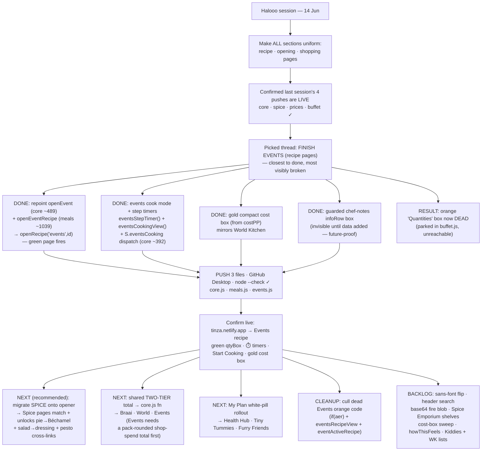

# TINZA — Session Handoff
_Last regenerated: 14 Jun 2026 — **EVENTS recipe pages migrated to full braai/World parity.** Old orange box now dead. **PUSH core.js · meals.js · events.js**_

---

## ✅ Done this session — Events recipe pages now match Braai & World Kitchen

The goal was uniformity across **recipe / opening / shopping** pages. We pulled the **Events recipe-page** thread (it failed 5 of 6 audit checks — closest to done, most visibly broken). It now renders through the universal opener with full form **and** function parity.

### 1. Both Events openers repointed onto the universal opener (`core.js` + `meals.js`, PUSH)
- `openEvent(id,t)` (**core.js ~489**) and `openEventRecipe(id)` (**meals.js ~1039**) used to `set({eventActiveRecipe:…})`, which tripped the old **orange "📊 Quantities" box** before the green page could ever fire.
- Both now call **`openRecipe('events', id)`** → the migrated `eventsRecipeOpts` green page.
- Checked every entry point: the 3 `openEventRecipe(` calls in `buffet.js` route through the repointed meals function; the events list uses the repointed `openEvent` + `openRecipe('events',…)` directly. **All ids resolve** through `eventsResolve`. Nothing left sets `eventActiveRecipe` truthy → the `if(aer)` dispatch (events.js 1066) and the orange `eventsRecipeView` (buffet.js 842) are now **dead code, parked** (not culled this session — kept the diff small).

### 2. `eventsRecipeOpts` enriched to full parity (`events.js`, PUSH)
- **Cook mode + step timers** — was `methodBox(…, '')` with empty cook action and `methodStep(i,s,'')` with no timers. Now passes a real **"👨‍🍳 Start Cooking →"** action and a per-step timer pill via new `eventsStepTimer()` (braai-style ⏱️ clock + `fmtTimerLabel`, inside World's `methodStep` structure).
- **Compact gold cost box** — added, mirroring World Kitchen exactly (`💰 Estimated cost · N guests · ~R… / Per person ~R… / estimated food cost`), Pro-gated, driven by the precomputed `costPP`. (Food cost still also shows green inside the qtyBox — same double-show as World, intended.)
- **Chef-notes box** — added the World-style `infoRow` box (Chef notes / Pairs with / Nutrition / Storage / Did you know), **guarded** so it only renders when data exists. Events data carries none of these yet, so it's invisible for now but future-proof.

### 3. New functions added (`events.js`, PUSH)
- `eventsStepTimer(step)` — recipe-page per-step timer label.
- `eventsCookingView()` — fullscreen step-by-step cook mode, **mirrors `braaiCookingView`**, re-resolves via `eventsResolve` (no quote-laden data in onclick), wires the interactive `startTimer` button. Dispatched from **core.js ~392** via new `S.eventsCooking` line.

**Validation:** `node --check` ✓ on all three. Line counts: core.js 2338→2339 · meals.js 1047→1047 · events.js 1827→1902. Backups: `core.js.bak`, `meals.js.bak`, `events.js.bak`. Timer helpers (`startTimer`/`parseStepTime`/`fmtTimerLabel`) confirmed live in `utils.js`.

---

## 📤 Push (GitHub Desktop, one file at a time, into `sections/`)
- `core.js` — PUSH (openEvent repoint + eventsCooking dispatch)
- `meals.js` — PUSH (openEventRecipe repoint)
- `events.js` — PUSH (cost box + chef-notes box + cook mode + timers + 2 new functions)
- Replace this `TINZA_HANDOFF.md` in the repo root.
- _buffet.js NOT changed this session._

## ▶️ Confirm live after pushing
`tinza.netlify.app` → **Events** → open any cooking recipe (a Main, Starter, Dessert, or a finger food). You should now see, top→bottom: photo header · green **HOW MUCH TO MAKE** qtyBox (with guest ± + green food cost) · **How portion size works** · ingredients (pp · total) · **method with ⏱️ step-timer pills + "👨‍🍳 Start Cooking →"** · gold **💰 Estimated cost** box · Add to Plan / nav. Tap **Start Cooking** → fullscreen step mode with Previous/Next + a live timer button. The **orange "📊 Quantities" box should be gone everywhere.**

---

## 🗂️ Running backlog (old + new) — what's still to do for full uniformity

**Recipe pages**
- ⏳ **Migrate Spice onto the universal opener** (`RECIPE_SOURCES.spice` + `RECIPE_BUILDERS.spice`). Highest-leverage remaining move — makes Spice pages match every section **and** unlocks the **pie → Béchamel** + **salad → dressing** + pesto cross-links (each needs the opener first). _Next recommended thread._
- ⏳ **Cull dead Events orange code** (low priority cleanup): `if(aer)` dispatch (events.js 1066), `eventsRecipeView` (buffet.js 842+), and the `eventActiveRecipe` plumbing (buffet.js 959/1113, events.js reset actions). Safe to remove anytime — it's already unreachable.
- ⏳ Health Hub header-height polish (mixed 160/200/220px → 200px) + gliding category scales.

**Shopping / plan pages**
- ⏳ **Shared two-tier total** — extract Braai's inline two-tier (food cost green `#c8e840` + shop-spend gold `#f5c842` + "about these totals & ways to save" explainer, braai.js 42 + 360–376) into one `core.js` function (e.g. `twoTierTotals({cookTotal, buyTotal})`), then drop into Braai (replace inline) → World Kitchen (verify buy/pack total via `packs.js`) → Events (**first** build a pack-rounded shop-spend total — Events shopping list currently lists quantities with no prices).
- ⏳ Cost-box sweep: confirm Health / Kiddies / Meals recipe pages all show the same compact box; ideally one shared `costEstimateBox()` in core.js so it can't drift.
- ⏳ Two-total shopping block in World Kitchen once `packs.js` is verified.

**Opening / landing pages**
- ⏳ **My Plan white-pill rollout** — finish remaining sections: Health Hub, Tiny Tummies, Furry Friends (Braai + World done).

**Global / polish (carried forward)**
- ⏳ Global sans-font flip in `index.html`.
- ⏳ Header search filtering.
- ⏳ Replace the 542 KB base64 fire blob in `braai.js` with a repo image file.
- ⏳ Spice Emporium shelf population (Chutneys & Atchars, Sambals & Relishes, Jams & Preserves).
- ⏳ Braai per-person cost function.
- ⏳ `howThisFeels` soul-pass (all sections, written last).
- ⏳ Kiddies TODOs: icing butter/milk sweep · cooldrink 400ml/kid + ± · Treasure Chest Sandwiches · Malva Pudding Bites photo · method/ingredient audit.
- ⏳ World Kitchen pending: Asia spice/masala pass · India gaps (Butter Chicken, lamb/goat) · rice recategorisation · `wkMyPlanView` footer · warm-palette pass · named-cut corrections (Gango, Braaivleis).

---

## 🧭 Session flowchart

