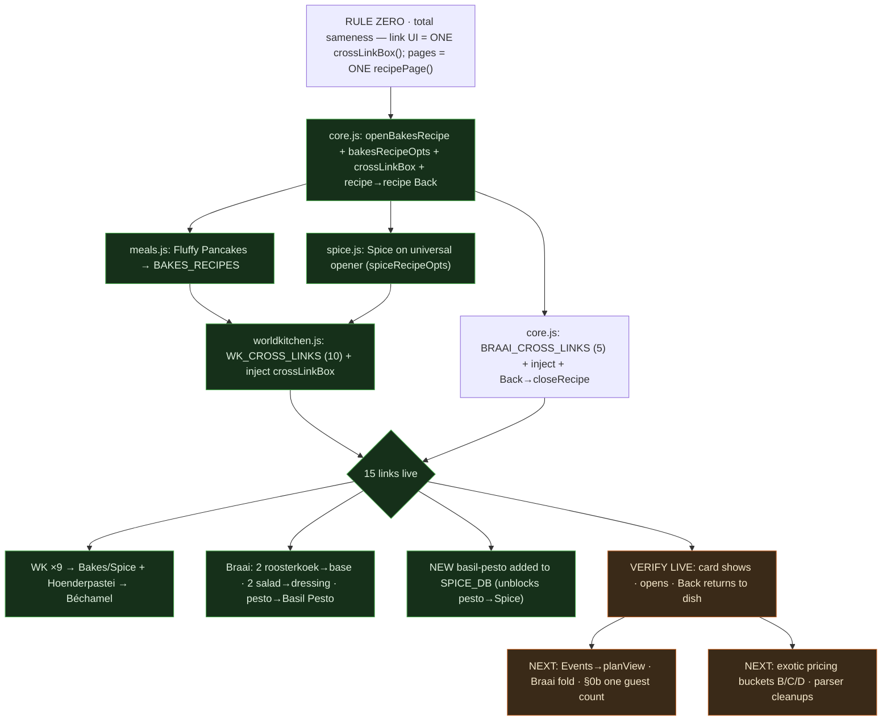

# TINZA — Session Handoff & Sameness Tracker
*Updated 16 Jun 2026 · read TINZA_STANDARD.md (now incl. §4g One Template) first every session*

## >> RIGHT NOW (pick up here)
1. **PUSH the CROSS-LINKS batch** — 4 section files, interdependent, push together:
   `core.js · meals.js · spice.js · worldkitchen.js`
   (every file `node --check`-clean; core.js backed up to %TEMP%\core.js.bak.crosslinks)
2. **Verify live — 15 cross-links:** open each source, confirm the **"Make your own → [recipe]"** card under the ingredients, tap → component recipe opens on the shared page → **Back returns to the source**:
   - WK ×9: Hawawshi→Pita · Rfissa→Msemen · Beyti→Lavash · Zapiekanka→Baguette · Bauernschmaus→Dumplings · Hortobágyi→Pancakes · Risalamande→Cherry Sauce · Prinsesstårta→Sponge · Kottu→Godamba.
   - WK ×1: Hoenderpastei→Béchamel.
   - Braai ×5: Roosterkoek-Garlic-Cheese & Roosterkoek-Boerewors→Roosterkoek (base) · Biltong Salad→Roquefort Dressing · Greek Salad→Greek Dressing · Pesto Pasta Salad→Basil Pesto.
3. If a card/return looks off: note the source — it's a `WK_CROSS_LINKS` / `BRAAI_CROSS_LINKS` entry or the builder.

---

## DONE THIS SESSION (CROSS-LINKS) — banked, node-checked

```
core.js
  - openRecipe/closeRecipe snapshot+restore _viewingRecipe
      => a recipe→recipe cross-link's Back returns to the ORIGIN recipe
  - NEW bakesRecipeOpts() + RECIPE_SOURCES.bakes/RECIPE_BUILDERS.bakes + openBakesRecipe(id)
      => Bakes (breads/flatbreads/cakes) render through the shared recipePage
  - NEW crossLinkBox() shared component (the one "Make your own →" card)
  - BRAAI_CROSS_LINKS map + crossLinkBox injected into the Braai recipe view;
    Braai recipe Back switched to closeRecipe() so the cross-link return works
      => roosterkoek-garlic-cheese/-boerewors→roosterkoek (base),
         biltongsalad→roquefortbraai, greekbraai→greekdressingbraai,
         pestopastasalad→basil-pesto
  - 2651 -> 2743 lines (backed up, no truncation), node --check OK

meals.js
  - Fluffy Pancakes MOVED Breakfast -> BAKES_RECIPES (id 'bf-pancakes' kept,
    cat 'quickbreads') so openBakesRecipe('bf-pancakes') resolves. node --check OK

spice.js
  - SPICE on the universal opener: spiceRecipeOpts() (reuses spiceCurScale+spiceFmt)
    + RECIPE_SOURCES.spice/RECIPE_BUILDERS.spice + openSpiceRecipe(id). Internal browse untouched.
  - NEW "basil-pesto" make-your-own added to SPICE_DB (amounts taken from the salad's
    own method) => unblocks pesto→Spice
  - FIX: spiceRecipeOpts yield label — "6 servings" no longer renders "6 6 servings"
  - node --check OK

worldkitchen.js
  - WK_CROSS_LINKS map (now 10): the 9 dish→Bakes/Spice + Hoenderpastei→bechamel-sauce;
    crossLinkBox injected into wkRecipeOpts notes slot. node --check OK

ALL 15 cross-links wired; every source + target id verified present (no dead links).
```

Rule Zero honoured: the link UI is ONE shared `crossLinkBox()`; the component pages
render through the SAME `recipePage()` as every other recipe. No page hand-patched.

---

## EARLIER (already pushed, for context)
- §4g **ONE TEMPLATE** folded into the Standard; **cost = Pro** re-lock (§7).
- Shared `buildPlanData` / `guestStepperCard` / `shoppingView` / `planView` built.
- **World Kitchen My Plan routed through `planView`** (two-cost block, pantry group,
  matching totals, dedup-by-priceName). prices.js + packs.js LIVE.
- WK pricing pass: +15 PRICE_DB entries, +34 PRICE_ALIAS, pantry routing, `mitmita`→pantry.
  Remaining exotic prices tracked in `TINZA_EXOTIC_TO_PRICE.md`.

---

## ROADMAP / TO-DO (next sessions)
```
 [DONE] Cross-links (this session)
   |
 1. SHOPPING/PLAN rollout: route EVENTS through planView/shoppingView
 2. Fold BRAAI onto buildPlanData (delete the duplicate cook/buy logic)
 3. ONE SHARED GUEST COUNT (Standard §0b): single session count used by
    landing/cuisine/recipe/plan; recipe green box opens at it (never 1)
 4. EXOTIC PRICING: apply Bucket B (pantry) / Bucket C (10 family prices) /
    Bucket D tail as Tina returns them — NEVER guess a rand
 5. PARSER CLEANUPS: vegetable/veg/palm ('/'-split artifacts), chouri o,
    fresh calf s liver; the "1 garlic clove" -> 'g'+'arlic clove' unit bug
 6. COSMETIC SWEEP (LAST): sectionHeader on health/meals/kiddies/tiny/furry/
    budget; kill gliding scales; remove meals search box
 7. THEN fill recipes
```

## CROSS-LINKS — all backlog items DONE (16 Jun)
- ✅ salad → dressing · ✅ pie → Béchamel · ✅ pesto → Spice · ✅ filled roosterkoek → base
  (plus the 9 World Kitchen dish→component). **15 total.**
- Future links reuse the pattern: a `*_CROSS_LINKS` map keyed by recipe id +
  `crossLinkBox()` in the section's builder; the target must be on the universal opener.

## WORKFLOW
- Push via GitHub Desktop only · `node --check` before every push · core.js sacred (back up first).
- Cross-link files are interdependent — push the 4 together.
- Fetch docs with `curl -sL` from raw.githubusercontent.com (never the API).


