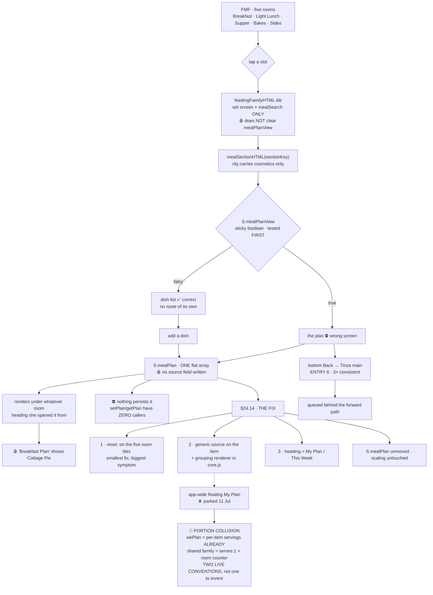

# FMF_PLAN_SOURCE_RULING.md — the session that found the root

**Written 6 Aug 2026, morning. Corrections folded 6 Aug, afternoon, after MF170 Q2–Q6 reported.**
Open the next chat with this file, `NAV_COLD_START.md` and `CLAUDE.md`.

**This file RULES on the FMF plan store. It supersedes the hypothesis in `NAV_COLD_START.md` §0.**

> ⚠️ **NO LINE NUMBERS ON PURPOSE.** Every anchor is a **SYMBOL**. Grep for it. ⚖️ RUNG 1f.

---

## 0 · THE ROOT — MEASURED, NOT INFERRED

# `S.mealPlan` IS ONE FLAT ARRAY SERVING ALL FIVE FMF ROOMS.

Code measured it (MF170 Q1). There is **no slot dimension, no second FMF plan key in the repo**.
Greps for `breakfastPlan` · `supperPlan` · `lunchPlan` · `lightlunchPlan` · `bakesPlan` ·
`sidesPlan` · `mealPlans` · `mealPlan[` — **zero matches.**

All five rooms are drawn by `mealSectionHTML(sectionKey)`. Its `configs` object carries title,
emoji, colour, sub-line, pills and recipe array. ⚖️ **It does not carry a plan key. The room
identity dies at the cosmetics and never reaches the store.**

🩸 **AND THE ITEM RECORDS NO SOURCE.** The object `toggleMealPlan` pushes is

```
{id, name, emoji, time, ingredients, costPP, nutrition, serves, cat, bakeServes, bakeMakes}
```

⚠️ **CORRECTION (6 Aug, pm): `cat` IS in the pushed object.** The morning draft omitted it from the
field list and discussed it only in prose. **The conclusion is unchanged** — `cat` is the pill
*within* the room (`plates`, `ovenbakes`), **never the room** — but the list now reads true.
⛔ **A filter-at-render fix still does not exist. The data was never written.** This is a
data-shape change, not a patch.

### The second shared singleton

`S.mealPlanView` is **a single boolean, not per-room**, carried in `navSignature()` as one slot.
Open the plan in Supper and it stays `true` for Breakfast, Bakes and Sides.
`sectionPlanView` also resolves its servings key via `searchServings` for `mealPlan`, so
**the servings count is one number across all five rooms too.**

---

## 0b · THE FORWARD PATH — MEASURED (MF170 Q2 · Q4)

**`S.mealPlanView` has exactly four writers in the repo. Two set, two clear.**

| | symbol |
|---|---|
| **SET true** | the header chip `myPlan:{…onclick:"setQuiet({mealPlanView:true})"}` in `mealSectionHTML` |
| **SET true** | `sectionPlanBtn('mealPlan', …, "setQuiet({mealPlanView:true})")` |
| **SET false** | `sectionPlanView('mealPlan', …, "setQuiet({mealPlanView:false})", '← '+cfg.title)` — the plan's own top-back |
| **SET false** | `TINZA_CHAINS.meals()` level 0 — reached **only** via `topBack(TINZA_CHAINS.meals(), 2)`, which `mealSectionHTML` passes **only in the recipe-detail branch** |

### 🩸 THE THREE PLACES IT IS NOT CLEARED — THIS IS ENTRY 12

1. **No default.** `mealPlanView` has **no entry in the initial `S`** in `data.js`. Both siblings
   do: `moodPlanView:false` and `budgetPlanView:false` are declared. It springs into existence on
   first write. *(This is why a genuine cold boot → Supper correctly shows the dish list.)*
2. **No room reset.** The home tile `{s:"feedfamily", …}` carries **no `reset:` field at all**.
   The Budget tile carries `reset:"…budgetPlanView:false"`. Same shape, opposite treatment.
3. ⛔ **The door she walks does not clear it.** In `feedingFamilyHTML` every room tile is
   `onclick="set({screen:'${o.s}',mealSearch:''})"` — **screen and search only.** And
   `mealSectionHTML`'s own `backJs:"set({screen:'feedfamily',mealSearch:''})"` — also no clear.

**The loop, closed:** open the plan (`true`) → `← Family Meals` (still `true`) → tap **any** of the
five rooms (still `true`) → the plan. Exactly her walk.

**Branch order inside `mealSectionHTML`:** `if(S.mealPlanView)` → **then** recipe detail → **then**
the list. ⚠️ **The flag is tested first, so it outranks even an open recipe.** There is no second
branch anywhere that chooses the plan over the dish list.

### Q4 — the categories screen has NO entry point of its own

The dish list **is** the categories screen (`cfg.cats` pills + `warmCard`). It is the
**fall-through** of `mealSectionHTML`, reached only when `mealPlanView` is falsy and no
`activeRecipe` matches. **There is no `set({screen:'breakfast', mealPlanView:false})` anywhere.**
The only ways in are the two clearers above.

🎯 **Confirms §3: the screen exists and is fully wired. Nothing routes to it. Stepped over, not missing.**

---

## 1 · ⚖️ THE RULING — TINA, 6 AUG, CONFIRMED TWICE

**§24.14 (number to confirm against `TINZA_RULINGS.md` before filing)**

> **INSIDE FEEDING MY FAMILY THERE IS ONE PLAN, ONE SHOPPING LIST, ONE COST.
> EVERY ITEM CARRIES A GENERIC `source` ROOM KEY. THE PLAN GROUPS UNDER IT.
> THE HEADING STOPS SAYING "BREAKFAST PLAN".**

| # | the ruling | why |
|---|---|---|
| 1 | **One plan stays.** `S.mealPlan` unmoved, unrenamed, unforked. No migration. | The plan screen is a **shop**, not a menu — *MENU · SHOPPING LIST · COST FOR 4 PEOPLE*. Five plans = five shopping lists for one trip. ⛔ **Worse than the bug.** Bakes and Sides & Basics are not times of day; a rusk belongs to the week. |
| 2 | **`source` is a GENERIC room key**, e.g. `fmf.supper` — **never** an FMF-shaped `mealSlot`. | ⚖️ So `wk.southafrica` and Health use the **same field**. Name it FMF-shaped and we build it twice. |
| 3 | **The grouping renderer lives in `core.js`**, not `meals.js`. | Same law as the shared `planView` / `shoppingView`. Build it in `meals.js` and WK rebuilds it. |
| 4 | **The heading stops lying.** *My Plan* or *This Week* — not "Breakfast Plan". | The array wears whatever room's name she opened it from. Cottage Pie appeared under **Breakfast Plan**. |
| 5 | **Top-back keeps working as-is** (`← Breakfast` returns to the room she came from). | Already correct. Don't touch it. |
| 6 | 🔴 **SCALING IS NOT TOUCHED.** | See §4. The people counter sits right next to the fix and looks like a two-minute tidy-up. **It is not.** |

⚖️ **This is the FIRST ROOM TO SPEAK THE FORMAT** — a rehearsal for the app-wide floating My Plan
(parked 11 Jul), not a detour before it.

---

## 2 · 🩸 THE CONDITIONAL — RIGHT PREDICTION, WRONG MECHANISM

Claude's hypothesis: *the slot branches on plan CONTENTS — empty shows the list, full shows the plan.*
**Prediction held on every pass. Mechanism was wrong.** The branch is `S.mealPlanView`, the sticky
boolean. **Contents never enter the test** (§0b).

⚠️ **TINA'S TEST COULD NOT TELL THEM APART.** She added Cottage Pie and opened the plan **in the same
breath** — "plan became non-empty" and "mealPlanView became true" flipped at the same instant.
⚖️ **The green passed for a reason nobody had named.**

📌 **THE FAMILY, FIFTH SESSION RUNNING:** a thing that looks like a measurement but has quietly
stopped measuring what it names. Rungs 4, 6, 8 — and now this. **That is the shape to watch.**

---

## 3 · ✅ WALKED THIS MORNING — LAPTOP, HARD REFRESH, FINGER NOT INFERENCE

| she did | she got |
|---|---|
| hard refresh → FMF → Supper (**empty plan**) | **dish list** ✅ correct |
| Oven Bakes → Cottage Pie → add → plan | plan, Cottage Pie in |
| Home → FMF → Supper (**plan has a dish**) | **the plan directly** ⛔ |
| plan → bottom Back | **Tinza main screen**, FMF skipped — **3× consistent, not intermittent** |
| FMF → **Breakfast** | screen reads **"Breakfast Plan" with Cottage Pie in it** 🩸 |
| tapped the word `Breakfast` in the header | ✅ **reached the categories screen — it EXISTS and is wired, just stepped over** |
| eggs → bottom Back | breakfast plan → bottom Back → main screen |

🎯 **The categories screen is not missing. That makes this a small fix, not a build.**

⚠️ **The hard-refresh row is now EXPECTED, not an anomaly.** See §3b.

---

## 3b · ⚖️ PERSISTENCE — RULED 6 AUG pm (MF170 Q3). **REPLACES the morning §3/§6 confusion.**

# ⛔ NOTHING PERSISTS ANY PLAN. THERE IS NO PLAN WRITER IN THE APP.

`tinzaStore` is the one door (loaded before `core.js` in `index.html`). It **has** the machinery:
`_default()` returns `{schemaVersion, preferences, favourites, plans:{}, pantry:[]}`, and it
exports `getPlan(section)` / `setPlan(section, arr)` with lazy per-section buckets.

**`setPlan` and `getPlan` have ZERO callers in the application.** A repo-wide grep for
`setPlan(` · `getPlan(` · `setPantry(` · `getPantry(` outside `tinzaStore.js` returns **four hits,
all in `tinza-census.js`** — the check that proves buckets are lazy. `sections/` calls them
**never.** Pantry likewise.

Only `preferences` (via `setPref` — theme, dev) and `favourites` (via `toggleFavourite`) reach
disk. The single writer is `save(state)`. **`S` is never serialised.**

### The three-way contradiction resolves — there was never a conflict

| claim | verdict |
|---|---|
| `NAV_COLD_START.md` §5.5 — *nothing persists `S`* | ✅ **TRUE, and it already said so** |
| Tina's laptop hard refresh → plan **EMPTY** | ✅ **TRUE, and the only possible outcome** |
| *"the plan survives a hard reload"* | ⛔ **FALSE. No code path can make it true.** |

⚠️ **CORRECTION TO THE MORNING DRAFT'S §6.** It attributed *"the plan survives a hard reload"* to
`NAV_COLD_START.md` **§3**. **That file makes no such claim.** Its §3 is *HELD ON TINA*; its
**§5.5 already states the inversion correctly** and already flags it as reasoning. **The
mis-citation is struck. There are not two storages. There is one door and it holds no plans.**

⚠️ **THE PHONE OBSERVATION IS NOT EXPLAINED BY CODE.** The remaining candidate is
⚖️ **Law 27 — the service worker served a cached page and the document was never torn down**, so
`S` was never re-initialised. 🩸 **THAT IS INFERENCE, NOT MEASUREMENT. It is owed a walked proof
on her phone before it enters any ruling.**

📌 `'mealPlan' in NAV_DATA_KEYS` is **history-pop survival inside one page life.** It dies with the
page. It is not, and never was, storage persistence.

---

## 4 · ⛔ PARKED, NAMED, NOT RULED

### 🔴 PORTION COLLISION — one basket, many serves counters

**Blocks the app-wide floating My Plan. Does NOT block §24.14.**

# ⚠️ CORRECTED 6 AUG pm — THIS IS **NOT HYPOTHETICAL**. BOTH CONVENTIONS ARE ALREADY LIVE.

| convention | who implements it today |
|---|---|
| **per-item servings** | 🔴 **`wkPlan` already does this** — `wkPlanToggle(id, servings)` stores `{id, servings}` |
| **`serves:1` + one room counter** | `mealPlan` · `budgetPlan` · `moodPlan` (the shared-renderer family) |

⚖️ **There is no answer to invent. There are TWO LIVE CONVENTIONS TO RECONCILE.** Option 2 below is
not a proposal — **World Kitchen shipped it.** Any single basket must reconcile the two, and all
three routes cost real work in the **gram tables**:

1. one household number rescales every dish → **each card's own counter becomes a lie**
2. every dish keeps its own serves → **"cost for 4 people" on the plan screen becomes a lie**
3. and either way the **taper** must decide: per dish, or per basket?

⚖️ **This is the actual reason the floating plan was parked in July. Its own session, clear head.**

### ⛔ ONE PLAN ACROSS THE WHOLE APP — do not rule on the back of a navigation bug

⚖️ **UPGRADED 6 AUG pm: the WK chip is now PROOF, not evidence.** All three World Kitchen headers
count `(S.wkPlan||[]).length`. **Different key, different writer (`wkPlanToggle`), different
renderer, different item shape** from `S.mealPlan`. *"My Plan (0)" while `S.mealPlan` held Cottage
Pie is a measured fact about two separate stores.*

**ELEVEN DISTINCT STORES. FOUR ITEM SHAPES.** (MF170 Q6.)

| surface | key | writer | shape | status |
|---|---|---|---|---|
| FMF, all five rooms | `mealPlan` | `toggleMealPlan` → `togglePlanItem` | object + `ingredients` | ✅ one flat array |
| Budget | `budgetPlan` | `togglePlanItem` | object + `ingredients` | ✅ shared renderer |
| Just Feed Me | `moodPlan` | `togglePlanItem` | object + `ingredients` | ✅ shared renderer |
| World Kitchen | `wkPlan` | `wkPlanToggle` | 🔴 **`{id, servings}`** | own renderer, `wkScreen==='wkplan'` |
| Health | `healthPlan` | several `set({healthPlan:…})` | object + `shopping` | own renderer, `healthShowPlan` |
| Tiny Tummies | `babyPlan` | `toggle(...)` | ⚠️ **bare ID strings** | own renderer |
| Furry Friends | `dogPlan` · `catPlan` | `toggle(...)` | ⚠️ **bare ID strings** | own renderer |
| Braai | `selectedMeats` + `selectedSides` | `braai.js` | two arrays, one plan | `braaiView==='myplan'` |
| Spice | `spiceCart` | `spice.js` | **object map** id→amount | `spiceListOpen` |
| Finger food | `fingerShopCart` | `fingerShopToggle` | **object map** | inline |
| Events / Buffet | `eventSelectedFingers` · `checkedBuffetItems` | `events.js` · `buffet.js` | id array / checked map | inline |

### ✅ bottom-nav **My Menu** — the owed row, CLOSED

`{screen:'mymenu', emoji:'📋', label:'My Menu'}`. The router's arm is a **single `comingSoonHTML`
call** whose body reads *"…each section keeps its own plan."* ⛔ **It reads no store at all.**
**It is a placeholder, not a surface. It is not `S.mealPlan` and it is not any other plan either.**

📌 `CLAUDE.md` §8 is a monument to exactly this kind of decision taken at speed. **Park it.**

---

## 5 · ▶️ MF171 — THE BRIEF

✅ **UNBLOCKED. All six MF170 questions reported and accepted 6 Aug pm.**

**Implement §24.14 in this order, STOPPING AND REPORTING AFTER EACH:**

1. **The `reset:` on the five FMF room tiles.** Smallest fix, biggest symptom. Doctor RED
   before/after. **Report, then stop.**
2. **Generic `source` on the pushed item + the grouping renderer in `core.js`.**
3. **The heading rename.**

🔴 **Scaling untouched. `S.mealPlan` unmoved. Not one `costPP` moves.**
**Doctor RED before and after. lawcheck 0 red 0 drift.**

---

## 6 · ⛔ CORRECTIONS TO `NAV_COLD_START.md`

| its claim | the truth |
|---|---|
| §0 — *`mealPlan` and `budgetPlan` are NOT in `NAV_DATA_KEYS`* | ⚠️ **STALE — already fixed.** MF169-B added both. The live `NAV_DATA_KEYS` carries them. |
| §0 — *"tapping a meal slot lands on the plan"* | ⚠️ **TOO STRONG.** Only when `mealPlanView` is sticky-true. The condition is now named — §0b. |
| §0 — ENTRY 12 is a forward-path bug | ✅ **CONFIRMED, and rooted.** §0 + §0b above. |
| §5.5 — *nothing persists `S`; `setPlan`/`getPlan` have no callers* | ✅ **CONFIRMED BY MEASUREMENT.** §3b. Its "reasoning, not measurement" caveat can now be lifted **for the code half only.** |
| §24.12 | ✅ **STANDS.** Tina confirmed the dish list *should* be in the path — the ruling was a specification, not an error. |

---

## 7 · ⏸️ STILL OPEN

1. ✅ ~~MF170 Q2–Q6~~ — **DONE 6 Aug pm, all six accepted.**
2. **ENTRY 11 / persistence** — ✅ **CODE HALF CLOSED** (§3b). ⏸️ Open: the **phone walk** that
   tests the Law 27 cache inference. **Her finger only.**
3. **ENTRY 6** — bottom Back from plan → main screen, 3× consistent. Queued behind the forward path
4. **PROOF 2** — Budget and World Kitchen. ✅ Storage grep done — they persist nothing either.
   ⏸️ **Needs her finger only.**
5. **BUG 7** — needs `_appNavDepth` in dev mode on her device. Its own brief
6. **§24.13** — ruled, not implemented. BUG 4 unblocked, not closed
7. **101 unclassified `NAV_DATA_KEYS`** — AMBER floor, not debt
8. **Every ruling except §5** — unmeasured against the code (Rung 6)
9. **The two buy ladders** — one behaviour, two implementations. De-dup when pack sizes land
10. ⚡ **FREE, NO CODE:** tag `healthy` records one at a time. The shelf degrades, never blanks
11. ⚠️ **Small, noted, not touched:** `fingerShopCart` is declared `[]` in `data.js` but
    `fingerShopToggle` writes `{}`. Harmless today — every read is `(S.fingerShopCart||{})[key]`.

---

## 8 · 🗺️ THE FLOWCHART



⚖️ **Law 2 — done is when Tina's finger says so, on her own device.**
